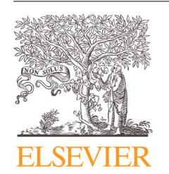
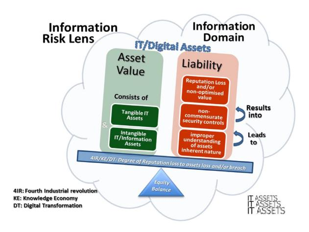
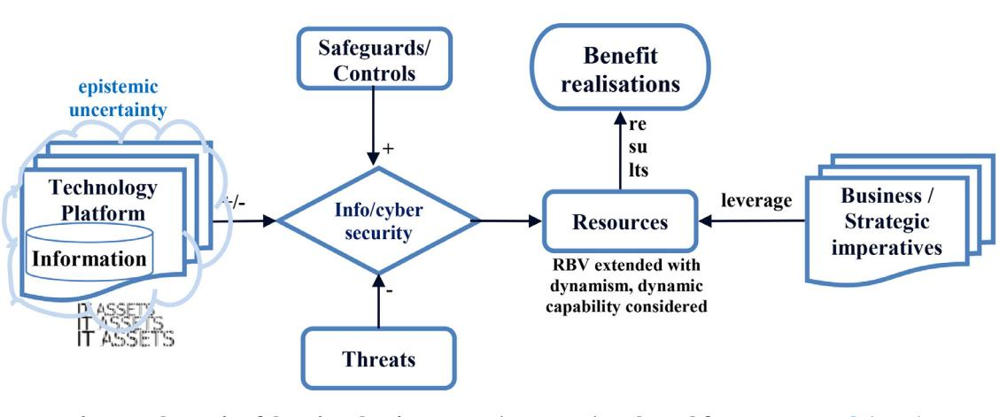
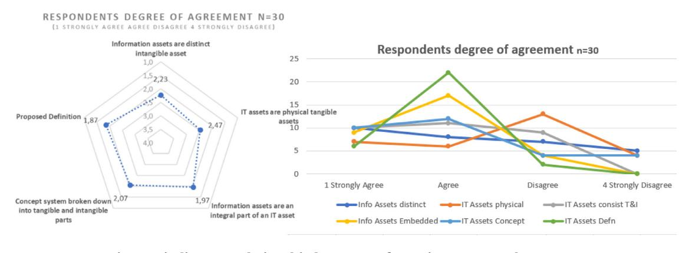
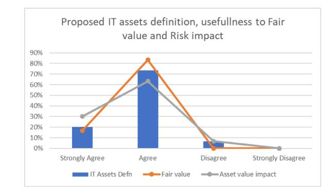
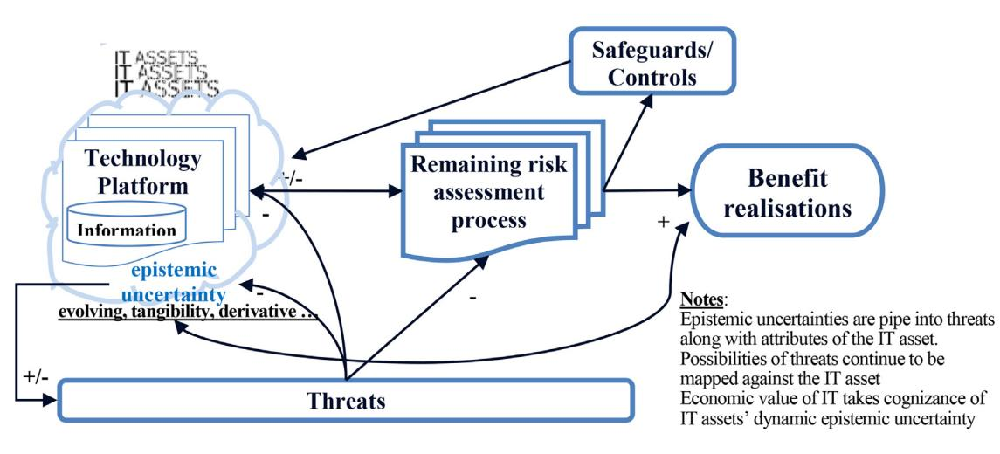

Available online at [www.sciencedirect.com](http://www.sciencedirect.com/science/journal/01674048)

journal homepage: [www.elsevier.com/locate/cose](http://www.elsevier.com/locate/cose)

# Towards a conceptual definition for IT assets through interrogating their nature and epistemic uncertainty

## *A. Kayode Adesemowo*

*Nelson Mandela University, Port Elizabeth 6019, South Africa*

## a r t i c l e i n f o

*Article history:* Received 10 August 2020 Revised 24 November 2020 Accepted 25 November 2020 Available online 4 December 2020

*Keywords:* Risk Epistemic uncertainty Tangibility Critical realism Digital transformation Information assets Conceptual definition IT assets

#### a b s t r a c t

Security breaches and consequentially reputational risk are upon us on an almost daily basis. They are part of the risk that beset organizations as they innovate and derive value from their information technology (IT) investments. IT assets that must be identified and safeguarded, and values extracted from them are contributors to the risk. Literature is awash with models of threats to assets and use of mid-range theories. There is a growing literature on digital technologies within digital transformation. However, intrinsic nature and epistemic uncertainty of IT assets have not received attention. Therefore, how can a conceptual definition for IT assets flow from understanding their nature, given their inherent epistemic uncertainty? Drawing from critical realism principles, this paper investigates existing definitions for- and re-interrogates the tangible nature (tangibility) of IT assets. It was found that despite their ubiquity and due to their evolving nature, IT assets lack universal understanding and definition. Executives (and professionals) views about IT assets are informed by their industry sector and role (present and/or previous). Consequently, this paper recommends a conceptual definition of IT assets that would assist; with coherence in the asset identification stage of risk assessment, (possibly IT audits and IT valuation programs), with understanding of the intrinsic nature of IT assets in themselves, and aid organizations in holistically engaging with IT assets. This paper's IT assets definition contributes to the call for theorizing the "IT" in IT. It poses new probing questions about 'old', 'established' beliefs as IT assets evolve in the era of digital transformation, fourth industrial revolution, knowledge economy and beyond.

© 2021 Elsevier Ltd. All rights reserved.

"… although Orlikowski and Iacono's call for theorizing the IT artifact and employing richer conceptualizations was issued over 10 years ago, the field has not witnessed much improvement in these regards. The number of IS theories are found to be 'depressingly few' … This situation can be attributed to several elements in our field such as heavily relying on the mechanistically adopted theories from reference disciplines … that is, researchers prefer to borrow a well-developed theory, tweak it and apply it to an IT phenomenon rather than to follow the risky business of theorizing."

## [\(Akhlaghpour](#page-27-0) et al., 2013, p. 164)

"… Despite the practice of information security being very well established, the theoretical goals and motivations behind it are imperfectly understood. The current paucity of good quality theories in the information systems domain leads to calls for development of our 'own' theory."

[\(Horne](#page-29-0) et al., 2019, p. 2)

*E-mail addresses:* [kadesemowo@soams.co.za,](mailto:kadesemowo@soams.co.za) [kayode@mandela.ac.za](mailto:kayode@mandela.ac.za) <https://doi.org/10.1016/j.cose.2020.102131>

0167-4048/© 2021 Elsevier Ltd. All rights reserved.

New Opportunities for Metalevel Research: The need for definitions is an example of new research opportunities at the metalevel. ... This offers new opportunities for future research. ... Research method norms are another example of a metalevel research opportunity. Research methods should not be considered universal dogmas. Instead, they need to be considered in a case-by-case context. ... but also whether the research aims at new theory development, theory revision, testing, or a more specific goal ... The contextualized nature of research methods offers ISS scholars new avenues for context-specific method development.

(Siponen and [Baskerville,](#page-30-0) 2018, p. 259)

## 1. Introduction

On a daily basis, in the news, in the corridors, in conferences, on social media et al., we are inundated with stories of security breaches and consequential reputational losses. These persist despite the advances in security controls and risk mitigation technologies. In this introduction, this paper examines the state of information, information technology (IT) and IT assets in the face of an ever-changing landscape.

### 1.1. Information, information technology and digital technology

Not only is IT evolving, the field of information systems (IS), and consequently information security (InfoSec) are ever advancing and evolving. Post novel coronavirus disease 2019 (COVID-19) pandemic [\(Dong](#page-28-0) et al., 2020), coupled with the advancement of the fourth industrial revolution (4IR), digital transformation, and accelerated progress into the knowledge economy (KE) and beyond, the degree of change and rate of evolution is bound to leap dynamically and dramatically. At the core of IS are information, technology, digital technologies and IT, which are relied upon and protected by organizations to help achieve their desired objectives. In the era of the 4IR (Lee et al., [2018;](#page-29-0) [Philbeck](#page-30-0) and Davis, 2019), KE and rapid diffusion of digital transformation [\(Wessel](#page-30-0) et al., 2020), information, IT and digital technologies are increasingly becoming intertwined.

In the dispensation of the 4IR, and underpinning the KE [\(Goede,](#page-28-0) 2011; [Ojanperä et](#page-30-0) al., 2019) and increasing diffusion of digital transformation, is the information that is processed, transmitted and stored by IT platforms,IS, digital technologies [\(Adesemowo](#page-27-0) et al., 2016, p. 2; NIST, [2018a,](#page-29-0) p. 1), or digital platforms [\(Constantinides](#page-28-0) et al., 2018). These lead to knowledge creation, driving innovations, shaping and reshaping organizations and [communities,](#page-28-0) and creating value (Ciriello et al., 2019, p. 149; [Mahy](#page-29-0) et al., 2016, p. 126). More so, information are building blocks in generating knowledge. They are strategic business advantage [assets/resources](#page-27-0) and as Ahmad et al. (2014, p. 28) had expressed, when engaged as knowledge, information assets are "vital for organizations to sustain competitive [advantage".](#page-30-0) In addition, [Laskowski](#page-29-0) (2014), Wilson and Stenson (2008), deemed them to be strategic intangible assets, just as [Adesemowo](#page-27-0) et al. (2016, p. 2), considered these

assets from a resource point of view to be business information assets leveraged upon to "gain a competitive advantage, … and/or to derive economic values".

The strategic [relevance](#page-29-0) of IT, forecast by Leavitt and Whisler (1958), was affirmed over half a century later, in the King IV Report (Institute of Directors in [Southern](#page-29-0) Africa, 2016, p. 30). Beyond that, and more importantly, what we are seeing now is the subtle but important shift from information technology to *technology* and *information*. In similar fashion, the Control Objectives for Information and Related Technology (COBIT 2019) framework [\(ISACA,](#page-29-0) 2018, p. 11) brought with it a shifting to *information* and *technology* (I&T). It is evident that IT is subtly, yet fundamentally 'evolving'. It is increasingly difficult to draw a clear 'demarcating' line between information, IT, technology and information, I&T, and digital technologies. Therefore, what is changing and what is evolving are explored in this paper.

More so, every organization requires information, along with the integral IT, technology and digital technology (DT) to function, derive value and remain competitive/innovative. In this regard, information and similar intangible assets, IT technology and DT are thus considered to be resources. A disruption to these resources due to misuse or security breach can often lead to disruption of an organization's operations and goals [\(Horne](#page-29-0) et al., 2019). This calls for a re-examination of risk.

#### 1.2. IT assets, epistemic uncertainty and risk assessment

Information technology assets (IT assets) are well known; so much so that they can be pointed to with ease and 'described'. So, it seems.The challenge,however, is that the people (actors) entrusted with IT assets typically engage with and describe IT assets from their discipline backgrounds. Invariably, IT assets are well known but imperfectly understood. The different actors, across IT, information systems, risk, finance/accounting, economics and audit, (whether practitioners, professionals, managers, or directors), do not agree on the description and definition for IT assets. This lack of coherence is exacerbated by the changing landscape such as 4IR, KE and digital transformation.

A common denominator in assets management, risk management and business/economic value are assets. Consequently, asset identification is at their root; IT and information – assets. The subject of assets is important because information systems security risk management starts from asset identification, classification, value of assets, as well as threats and vulnerabilities associated with assets. Assets are also an anchor of the security triplet along with threats and controls.

[Shedden](#page-30-0) et al. (2016) posited that in risk assessments, the asset identification phase has deficiencies, notably when conceptualizing and identifying (information) assets. This notion was also highlighted by [Adesemowo](#page-27-0) et al. (2016), who expressed that an often-overlooked aspect of the information risk quagmire is the lack of proper understanding of assets to be identified and safeguarded. They therefore raised the concern of the five 'P's; properly *understood*, properly *defined*, properly *identified*, (as well as properly controlled and properly retired). [Baskerville](#page-28-0) et al. (2020), in proclaiming the increasing pervasiveness and ubiquity of digital technologies, called for ontological reversal as digital technologies are now in fused view, shaping and creating (physical) reality.

IT assets have become important elements in all sectors of the economy globally, because of their capability to not only help support business functioning, but to also enhance efficiency of service and improve competitive advantage. These assets are now also shaping and transforming businesses, and even creating new business realities. Although IT assets may be well known to the various actors in the industry or within a domain, the manner in which IT assets have been described and managed differs in so many perspectives. To some, IT assets have been identified in terms of hardware and software and their components, to others, IT assets encompass the different aspects of information systems. Yet, for some, IT assets are resources that are tangible in the sense that they can be 'seen', whilst at the same time, seeing IT assets as being tangible because of the material impact they have on organizations. Yet others differ in their opinion on what IT assets are or should be or presume to be from different dimensions. These diverse opinions on the description of IT assets may be due to the changing landscape in the digital transformation space, hence the changing nature of IT assets themselves.

This paper moves on the premise that assets are just as important as uncertainties of threats and vulnerabilities. In fact, there are *epistemic uncertainties* within assets themselves. On the understanding that assets (information, IT, technology, digital technologies) are known phenomena, this paper, hinged on critical realism (CR) philosophy, looks at epistemic uncertainty in assets by re-interrogating the nature of IT assets. In this paper, IT assets are loosely used alongside information assets and digital assets. Although important, discourse on information security, digital security and cybersecurity [\(Horne](#page-29-0) et al., 2019) fall however outside the purview of this paper. For ease of reference, the term, information systems security (Siponen and [Baskerville,](#page-30-0) 2018), is used loosely in this paper. Hence, this paper narrows down to risk assessment process, focusing on risk identification activity.

Noting that IT assets are 'known' phenomena, CR is essential in unearthing (demi-regularities and nuances of) the nature of assets (as a phenomena or reality) rather than overly focusing on causal relation of assets to threats (risks). This paper is a bold attempt at casting/translating IT assets away from the notion of simply being intrinsic objects, into the realm of phenomena in the real domain, where they are subjected to a vast array of shifting external and internal conditions such that consistent, predictable outcomes are seldom, if ever, possible (Wynn and [Williams,](#page-30-0) 2012, p. 52).

## 2. Risk in the knowledge economy, digital economy, fourth industrial revolution and digital transformation era

In the next section, the concept of risk is revisited, followed by the notion of IT assets as conceptual artefact against the backdrop of mid-range theories. Thereafter, the research domain and methodology are discussed. Then, discourse based on the search for a definition of IT assets, in tandem with discoveries from (structured) interviews/survey to elucidate demiregularities that are at play. The paper concludes with discussions and contributions to the body of knowledge in 1) articulating the dual-contrasting nature and disparate attribute of IT assets, 2) deriving from the demi-regularities, proposing a conceptual working definition for IT assets, 3) discussing the intrinsic attributes (as a conceptual artefact) and posing probing questions with regard to established beliefs of IT assets (as IT assets evolve and advance).

In this paper, going forward, the terms IT, ICT, DT, I&T, and technology and information, as well as technological platform are used loosely and where needed or necessary, context is provided. Furthermore, in this paper, information security, cybersecurity and information systems security are used interchangeably. This does not mean that cognizance is not taken of the diverse views and understanding of the different terminologies. This paper rather refrains from the discourse and acknowledges the ubiquity of IT assets across them.

## **2. Risk in the knowledge economy, digital economy, fourth industrial revolution and digital transformation era**

Notwithstanding the increasing importance of information as a business driver (seen to be an intangible asset) on one part (Saunders and [Brynjolfsson,](#page-30-0) 2016, p. 83), and when it is not properly controlled, as a de-enabler (reputation loss liability) (See [Adesemowo](#page-27-0) et al., 2016, p. 3), organizations' IT assets continue to suffer targeted and erroneous security breaches [\(Okae](#page-30-0) et al., 2019; [Richardson](#page-30-0) et al., 2019).

Organizations are geared toward optimizing benefit realization from their resources. Inevitably, in the process of benefit realization, organizations are exposed to risks that must be managed, as there are threats on the assets for which controls (safeguards) must be put in place. In the context of this paper, there are threats from the assets that must be understood. To look at risk, especially from a security point of view, a starting point is the concept of security breach and then uncertainty.

#### 2.1. Security breach

Threats are real. [Adesemowo](#page-27-0) et al. (2016), Okae et al. [\(2019\),](#page-30-0) and [Richardson](#page-30-0) et al. (2019), highlighted a few of these threats and security breaches. Platforms such as CSHub [\(www.cshub.com\)](http://www.cshub.com), KrebsOnSecurity [\(www.krebsonsecurity.](http://www.krebsonsecurity.com) com) and ThreatPost (www.threatpost.com) detail numerous security incidents on a continual basis. These breaches also include misalignment between IT assets, assets disposal and IT Service Management (ITSM). Adesemowo and Thomson (2013), highlighted one such [misalignment,](#page-27-0) in the case of a laptop disposal at a major telecommunication company where the material impact of a single laptop came to fore. Jones [\(2009\)](#page-29-0) highlighted the danger and level of information that individuals and organizations inadvertently give away when they dispose of computers and hand-held devices. Theft of unencrypted hard-drives on laptops was behind the Coca-Cola breach in December 2013; impacting 74,000 persons, which led to an Identity Protection offer that was estimated at US\$11m per year. Similarly, the 2007 case of BlueCross BlueShield Tennessee's (BCBST) 57 hard-drives, resulted in a HIPAA/HITECH fine of US\$1.5m; this spiraled over US\$17m, when considering reputation, legal and other ancillary cost.

Globally, there have been a series of widely publicized corporate security breaches. For example, the Capital One 2019 breach affecting roughly 106 million customers might result in 'mop up' costs and a possible fine projected at US \$500m; most of which will, however, be absorbed by Capital One's cyber-security insurance cover! Equifax, on the other hand, according to a Georgia Court order (1:17 md-2800-TWT) got away with a US \$380m settlement (up to approximately US \$500m to cater for out-of-pocket losses if claimed, and potentially up to US \$2b if all 147m affected class members filed for credit monitoring). Equifax might incur additional costs of close to \$79m in Plaintiff attorneys fees and reimbursement, and possibly mandated to invest US \$1b in security and risk mitigation technological and process programs for the next five years for its 2017 breach [\(https://www.equifaxbreachsettlement.com/\)](https://www.equifaxbreachsettlement.com/). The proposed penalties for Marriott and British Airways for their 2018 breaches are £99.2 million and £183.4 million respectively, whilst EasyJet's estimated potential lawsuit claim, as at June 2020, stands at £18 billion for exposing private details of approximately nine million passengers. Facebook, apart from the US \$5b fine, was mandated to implement structural privacy practices, including corporate structure, and the role of the CEO in respect of privacy ring-fencing (Federal Trade [Commission,](#page-28-0) Fair L, 2019). Fining of corporations arising from security breaches/lapses has continued unabated into 2020. Beyond just fines and demands for change, devastating attacks have led to the demise of organizations. One such is DigiNotar, which in 2011 did not recover from the breach of its root certificate. Globally, regulations, including UK's Data Protection Act, Australian and Canadian Privacy Acts, California Information Practices Act (California Civil Code, 1798), and Singapore's Personal Data Protection Act, as well as Indian Privacy (Protection) Bill, 2013, South Africa's Protection of Personal Information Act (POPIA), 2013, the EU's GDPR, amongst others, are in place and keeping up with the changing landscape of the 4IR, KE and beyond [\(Burdon,](#page-28-0) 2011; [Fernández-Alemán](#page-28-0) et al., 2013). The extent of the security breach/lapse/exposure in the COVID-19 period and post the COVID-19 era remains to be seen. We are already seeing Microsoft MS Team, Jitsi Meet and Zoom web conferencing security concerns [\(Blumberg,](#page-28-0) 2020), as well as healthcare systems (See https://threatpost.com/healthcare-in-crisisdiagnosing-cybersecurity-shortcomings-in-unprecedentedtimes/161917/).

#### 2.2. Epistemic uncertainty

Apart from security breach, the other aspect to look at is uncertainty.

Rooted in risk theory is the concept of uncertainty. Solberg and [Njå \(2012,](#page-30-0) p. 1212) expressed that uncertainty "is a characteristic of the world and how it works .... Even if there was such a thing as perfect knowledge we still have the problem of imperfect observations and entropic effects thereof". Uncertainty comes to the fore on two fronts: aleatory (representing variation) and epistemic (due to lack of knowledge). Whereas aleatory uncertainty concerns itself with probabilities, epistemic uncertainty comes from lack of knowledge [\(Aven,](#page-28-0) 2016, p. 5). This lack of knowledge can be about the attributes of a system or the incomplete knowledge of a phenomenon/reality. Uncertainty thrives under the unknown, whilst risk assessment and management attempt to manage the unknown by bringing certainty to the unknown [\(Roeser,](#page-30-0) 2012).

Uncertainties are typically examined from environmental, process and threat points of view [\(Borch,](#page-28-0) 1967; Matt et al., 2015). Often, [systems](#page-29-0) or objects are not studied with the same scrutiny as environmental aspects or threats. Systems and objects are treated as *matters* whose forms are not particularly interrogated. It is therefore not surprising that risk in IS security tends to focus on threats; however, representing and expressing epistemic uncertainty of assets lags those of threats. IT assets, whether as artifacts or more importantly as phenomena, are not probed enough. Epistemic uncertainty that stems from 'lack of knowledge' [\(Aven,](#page-28-0) 2016) of the intrinsic and transitive nature of IT assets is very valuable and often overlooked. Hence, much focus has been on aleatory uncertainty caused by probabilistic threat events.

The advancement and complexity of IT (inclusive of DT) have brought about rapid changes in organizations' operations and transforming organizations' identities. Along with the use of IT, is the increasing concern associated with information risks [\(Okae](#page-30-0) et al., 2019, p. 449). As IT assets (inclusive of digital technologies/digital assets, information assets) become integral of organizations,the dependency between business/enterprise/organization and IT (digital technologies) becomes as inseparable as one of 'integral-being'. Nonetheless, uncertainties carry through to risk, which obviously goes beyond those of threat to an asset only. IT assets (inclusive of digital technologies) as with any *matter*, carry with them an inherent attribute of epistemic uncertainty [\(Aven](#page-28-0) et al., 2014). IT assets as assets vary as wide as resources, infrastructure, systems, or objects or even components. For some, IT assets can be fixed cost for the IT/computing infrastructure assemblage or cloud platform or fixed cost for IS resources, including capability and/or knowledge and/or humans. IT assets can even be functional systems: ERP systems, HR systems, and so on. For others, these assets could be the different segmentations of networking infrastructure, communication and development platforms. Yet, for some, IT assets could be low levels of servers, PC, printers, productivity software and so on. The forms, shapes and approaches vary across organizations and even within organizations.

#### 2.3. Risk twin legs: assets and threats (liability)

At its core, risk has two legs; one comprises assets identified and valued, and the other,threats to assets identified and analyzed. These two legs feed into risk mitigation in the risk management process. Therefore,this means that without an asset, there is no risk. Likewise, without a threat and possibility of vulnerability, risk is non-existence. What is prevalent in literature are threat modelings. Nevertheless, this paper instead focuses on the assets leg of risk; espousing inherent epistemic uncertainty.

For an asset to be safeguarded, controls must be applied to it at a measure that balances the control cost (cost of putting the control in place) and the asset cost (value of the asset to be protected/preserved) as captured in [Fig.](#page-4-0) 1. It then implies that the value of the asset must be determined in such a manner that it is not excessively over-valued nor under-valued for risk

**Fig. 1 – Risk leg balancing act – authors' viewpoint on equity balancing link between reputation loss, benefit realization and IT assets value.**

management purposes. For tangible assets, especially those of property, plant and equipment (PPE), there are several valuation metrics and methodology. However, with the evolving nature of IT assets and transformation (digital assets, digital objects, digital technologies), identification of IT assets and their valuation are becoming increasingly difficult.

Perhaps, one needs to ask, with digital transformation taking place and the KE becoming entrenched, where intangibles are becoming very important [\(Ahmad](#page-27-0) et al., 2014; Saunders and [Brynjolfsson,](#page-30-0) 2016) yet less distinct, what must become of the value of IT assets (inclusive of carrying information and capabilities). Should intangible (and capability) be part of IT assets or disjointed from IT assets. How do we approach the inherent complexity and epistemic uncertainty?

In answering, an approach might be from the angle of risk assessment, to look at the hierarchy of risk from enterprise to unit, from macro to micro. As such, we can possibly move on the premise that information drives organizations and information is contained and processed with/through IT assets, with IT assets in themselves also 'edited' along the way [\(Faulkner](#page-28-0) and Runde, 2019; [Kallinikos](#page-29-0) et al., 2013).

Having done that, a foundation has been laid on how to proceed with IT assets value that could be used for risk assessment purposes. IT assets value and risk value can be ascertained at information risk level and with digital business strategy, rather than at IT risk level as depicted in Fig. 2. In essence, it means we can neither examine IT risk without considering the information (the live wire), nor can we engage information in isolation of the enterprise that relies on the information, and the digitaltechnologies that orchestrates value derivation. There is an intertwining effect. This is analogous to how we do not regard business value in isolation of IT value, and IT value in isolation of the organization [\(ISACA,](#page-29-0) 2018; [Mandrella](#page-29-0) et al., 2020; [Maoz](#page-29-0) et al., 2010; Saunders and Brynjolfsson, 2016; Wilson and [Stenson,](#page-30-0) 2008).

### 2.4. IT assets definition as conceptual artefact

This paper, in reexamining the nature of IT assets as an integral aid towards their identification (and valuation), is

**Fig. 2 – Information risk – authors' viewpoint on link between reputation loss, benefit realization and IT assets value.**

inherently not apposite to the call for theorizing IT artefacts. [Orlikowski](#page-30-0) and Iacono (2001, p. 131) in calling for theorizing IT artefacts, strongly advocated five premises: definition; embedding (in some time, place, discourse, and community); multiplicity; independence; and dynamism. This is akin to conscious theorizing of "IT" in IT and IS (Faulkner and Runde, 2019; Grover and [Lyytinen,](#page-29-0) 2015; [Orlikowski](#page-28-0) and Iacono, 2001), and the call by [Walsham](#page-30-0) (2017) regarding ICT4D. By so doing, this paper purposefully engages in creating abstract knowledge that is identifiable, discussable and engageable in the form of a conceptual, generic working definition for IT assets.

Going by [Alter's](#page-28-0) (2017, p. 688) viewpoint, the IT assets definition recommended in this paper becomes a conceptual artefact that provides a conceptual lens to understudying phenomena in IS (Grover and [Lyytinen,](#page-29-0) 2015). As Alter [\(2017,](#page-28-0) p. 675) puts it, "one of the central purposes of most research disciplines is to create, improve and disseminate conceptual artifacts that express or encapsulate knowledge related to questions that the discipline addresses". In this regard, the conceptual generic working definition for IT assets is a conceptual artefact, loosely belonging to Gregor Type II explanatory theory and partly Type IV [\(Alter,](#page-28-0) 2017).

Against this backdrop, this paper investigates the definitions and nature of IT assets. From the re-interrogation, the nature of IT assets should be better understood, with pertinent constructs to aid theorizing "IT" and IT assets proffered for researchers to further engage with. In this paper, deriving from the demi-regularities (arising from the constructs), a conceptual working definition for IT assets is proposed, to assist with asset identification in the identification phase of risk analysis/assessment, which can also be of use for value evaluation.

## 3. Research domain

"… the information systems field has become a rich tapestry of theoretical and conceptual foundations. As new theories are brought into the field, particularly theories that have become dominant in other areas, there may be a benefit in pausing to assess their use and contribution in an IS context."

#### (Wade and [Hulland,](#page-30-0) 2004, p. 107)

"On the other hand, … the IS field identity cannot be tied exclusively to the immediate nomological net surrounding the IT artifact. … IS researchers should adopt a broader view of the IT artifact."

#### [\(Akhlaghpour](#page-27-0) et al., 2013, p. 151)

This section first looks at the research focus followed by the research questions, research principle, methodology and approach.

### 3.1. Focus areas

The focus of this paper is the re-interrogation of the nature of IT assets that are (continually) evolving, and the conceptual definition of IT assets as it relates to identification of assets, especially in risk assessment, (as well as identification, valuing and safeguarding as it touches on IT governance). Asset identification found relevance across multiple fields of IS, accounting, economics and so on. Frameworks such as COBIT 2019 [\(ISACA,](#page-29-0) 2018), King IV (Institute of Directors in Southern Africa, 2016), Enterprise risk [management/internal](#page-29-0) controls frameworks by Committee of Sponsoring Organizations of the Treadway Commission's [\(COSO,](#page-28-0) 2013; 2017), and literature [\(Ahmad](#page-27-0) et al., 2014; Goosen and [Rudman,](#page-29-0) 2013; Kim et al., 2018) [concurred](#page-29-0) that IT is strategic. It is further concurred that information and IT and their risks must be governed and managed strategically as one and as integral. Not only is the governance of IT coming to the fore at top management and board level (Antwerp [Management](#page-28-0) School, CEGEKA, KPMG, Samsung, 2016; Haghjoo, 2012; Moody and Walsh, 1999) as predicted by Leavitt and [Whisler](#page-29-0) (1958), the safeguarding of *information* and *technology* are also critical.

There is a mismatch, on the one hand, of technological knowhow (of controls and IT assets), and on the other hand, sophistication and technological advances of (safeguarding) controls that are applied to IT assets. Much research has focused on threats and controls without giving due consideration to attributes of IT assets and their epistemic uncertainty. There is thus a need to research this important aspect of IT assets, which should assist (alongside threats and controls) with the resultant reputational loss arising from loss or security breaches. In line with deriving a conceptual definition for IT assets, this research work investigates the attributes, structures and mechanism of IT assets not just as devices but as technological objects having their own technical identities. No wonder literature has been calling for a rethink of IT assets, information assets and intangibles, whether for risk or for valuation or benefit realization [\(Adesemowo,](#page-27-0) 2019; [Ciechanowicz,](#page-28-0) 1997; [Foroughi,](#page-28-0) 2008; [Haider](#page-29-0) et al., 2006; [Laskowski,](#page-29-0) 2014; Poller et al., 2014; Saunders and [Brynjolfsson,](#page-30-0) 2016; [Shedden](#page-30-0) et al., 2016; Tillquist and [Rodgers,](#page-30-0) 2005; Wilson and [Stenson,](#page-30-0) 2008).

A critical component of- and process in risk analysis is the identification of assets. Yet, a challenge in the identification process (of IT assets) is the lack of agreed identification metrics and non-coherence of the common understanding of IT assets [\(Adesemowo,](#page-27-0) 2019; [Shedden](#page-30-0) et al., 2016). Shortcomings in the asset identification phase carry through to the rest of the risk assessment/management processes, leading to incorrect risk analysis and inaccurate outcomes [\(Adesemowo](#page-27-0) et al., 2016, p. 8; [Shedden](#page-30-0) et al., 2016, p. 300). There are two nuances: one is the nature of IT assets to be identified, and the other is the definition of IT assets to guide identification. Focus in risk analysis has typically been on threat models, with not much done in respect of the *epistemic uncertainty* of the nature of IT assets themselves, as explored in this paper.

The very nature of IT assets must, therefore, be factored in and re-examined in order to properly identify IT assets (and determine appropriate value for IT assets) when performing risk analysis/assessment.

#### 3.2. IS and IS security theories shaping assets (resources)

As stated, this paper is an attempt at theorizing IT assets by proposing a conceptual working definition. Attempts have been made to define resources in information security. For instance, [Horne](#page-29-0) et al. (2019) drew upon Gregor's theory types and Baskerville's information warfare framework.

In [Horne](#page-29-0) et al. (2019, [Fig.](#page-4-0) 1),the goal of information security is not just confidentiality, integrity and availability but also to effectively and efficiently leverage on business resources. This is not farfetched from accounting principles: assets are essentially economic resources; not only that, assets additionally have the potential to produce economic benefits.

In IS, the goal of engaging resources is for benefit realization (economic benefits). The Resource Based View (RBV) has been used to engage resources for benefit realization, with resources in RBV defined as assets and [capabilities](#page-30-0) (Wade and Hulland, 2004, p. 109). From an RBV viewpoint, distinction is made between 'tangible' assets and 'intangible' capabilities. However, this RBV's 'static' distinction between tangible assets and intangible capabilities is being interrogated. Hence, researchers are advocating for alternates to RBV or an extension of RBV: such as those of dynamic capability and IT affordance synthesized into capability [\(Eitiveni](#page-28-0) et al., 2018; [Vartiainen](#page-30-0) and Hansen, 2019).

[Fig.](#page-6-0) 3 depicts the physical representation of the underlying theories that shape IT assets as resources of value. From risk theory, not only are there (aleatory) uncertainties relating to threats, there is systemic uncertainty within assets themselves. These uncertainties must be unearthed and safeguarded to ensure resources are utilized effectively and efficiently, in a bid to enable organizations to actualize their business imperatives through leveraging on their resources, thereby achieving benefit realization [\(Maoz](#page-29-0) et al., 2010).

Re-interrogating the nature of IT assets using CR principles is essential in arriving at not only a conceptual working definition for IT assets but advancing knowledge of IT assets as research entities and thence, theorizing conceptual artefacts.

#### 3.3. Research question

Science advances best when one understands the underlying nature of a concept and the availability of metrics or indices of measurement. A starting point is in understanding and definition, thus for this paper, it is in the understanding and definition of IT assets.

**Fig. 3 – Schematic of theories shaping assets (resources) – adapted from Horne et al. [\(2019\).](#page-29-0)**

The question in this regard are:

What is the understanding of IT assets and how can 'IT assets' be defined given their inherent nature and *epistemic uncertainty?*

Closely linked are:

Does understanding of IT assets hold true in the KE and/or in the face of digital transformation, and how does this impact on risk identification?

What conceptual definition could be given for IT assets, noting the demi-regularities at play, and in what way can such definition intrinsically advance the field of IS in the era of digital transformation, 4IR, KE and beyond?

Therefore, the probing questions then would be:

- 1 What are the understandings of IT assets in literature and in practice?
- 2 Does the understanding of IT assets cohere?
- 3 If they do not, what might be the underlying reasons?
- 4 How best can a conceptual definition be given?
- 5 Should IT assets be strictly divided as tangible and intangible (in hardline posture)?
- 6 How do IT assets conform to a form: material and nonmaterial forms?
- 7 Should IT assets be broadly or narrowly defined resources, or both (flexibility)?
- 8 What conceptual definition could be given for IT assets, noting the demi-regularities at play?
- 9 How can such definition intrinsically advance the field of IS in the 4IR, KE and beyond?

### 3.4. Research methodology

It is important to remember that CR is not a theory, but a metatheory or "a general orientation to research practice, providing concepts which help create more accurate explanations of (social) phenomena than those which currently exist"

To find answers this paper, founded in critical realism paradigm, re-interrogates what we know of IT assets.This section on research methodology discusses the research philosophy and research approach. For the sake of readability, the research methods are cross-referenced in ['Appendix](#page-20-0) B: Research Methods' and in the section 'Search for Study on Nature ofand Definition of IT Assets'

#### 3.4.1. Research philosophy/principle: critical realism

The research philosophy hinged on CR (Archer et al., 2013; [Scott,](#page-30-0) 2005), because CR allows for [abstraction,](#page-28-0) (re)investigation of traditionally held beliefs and proffering of renewed insights/explanations. It draws on analogy or theories from other fields to explain nuances in the phenomena themselves [\(Bennett](#page-28-0) et al., 2019; [Vandenberghe,](#page-30-0) 2013), instead of simply using theoretical frameworks from reference discipline as conceptual lenses to understudy phenomena [\(Grover](#page-29-0) et al., 2019, p. 169). CR resides in the domain of actualities rather than causality and effects. Beyond the transitive process of science, the possibilities of perception and of theoretical knowledge, are continually being extended. [Krauss](#page-29-0) (2005, p. 761) opined that the "concept of reality embodied within realism is thus one extending beyond the self or consciousness, but which is not wholly discoverable or knowable." Furthermore, in contrast to positivism and interpretivism, which assume a flat ontology, CR acknowledges a realist, stratified ontology (Shi, [2019,](#page-30-0) p. 2; [Zachariadis](#page-30-0) et al., 2013, p. 857): real, actual and empirical domains. By these, this paper was able to abstract the tangibility aspects of IT assets, as well as investigate the intrinsic nature of IT assets. In subscribing to Roy Bhaskar's CR, it must be noted that this paper does not conform to critical theory [\(Vandenberghe,](#page-30-0) 2013, p. 2). More so, while CR, as a philosophy, guides research approach, critical theory, on the other hand test causality. Hence, Wynn and [Williams](#page-30-0) (2020, p. 51) reminded us that it is important to remember that CR is not a theory, but a metatheory or "a general orientation to research practice, providing concepts which help create more accurate explanations of (social) phenomena than those which currently exist".

Consequently, this paper stepped away from using reference or mid-range theories to test hypothesizes or postulate new theories. Reducing an explanatory, interrogatory study founded on CR principle to (traditional) pure empirical study will, however, negate the very essence of the research study and will lead to entropic disorder. CR has, nevertheless, come of age, as seen in special issues of MIS Quarterly in 2013 [\(Mingers](#page-29-0) et al., 2013, p. 799; Shi, [2019,](#page-30-0) p. 1) and the Electronic Journal of Information Systems in Developing Countries (EJISDC) in 2018 [\(Heeks](#page-29-0) et al., 2018), amongst others.

In CR, research theory and data are intrinsically related. In addition, theories and concepts are constantly being developed [\(Bennett](#page-28-0) et al., 2019, p. 174). CR, with its ontological and epistemological foundations, affords the potential to establish alternative epistemic scripts that can enhance the theory product in IS research [\(Williams](#page-30-0) and Wynn, 2018, p. 315). In line with [Alter's](#page-28-0) (2017) argument that conceptual artefacts include Gregor Type IV theories as well as Type II explanatory theories, CR is well positioned to interrogating and postulating conceptual artefacts, such as an ontological/conceptual generic working definition and model of IT assets.

##### 3.4.2. Research approach and strategy: plurality

Linked closely with CR is plurality, threading along the path of [multi-methods](#page-29-0) founded on triangulation (Lievrouw et al., 1987; Raman and [McClelland,](#page-30-0) 2019, p. 11; Thapa and Omland, 2018, p. 3). Plurality of methods offers improved validity of insights into events and underlying mechanisms [\(Heeks](#page-29-0) and Wall, 2018, p. 4), which [Mingers](#page-29-0) (2001, p. 243) referred to as multi-methods. This paper is then able to logically reason through the findings of two approaches, namely exploratory and interviews, to find answers to and explain the research question and probing questions. The survey instrument was validated by two domain experts. The author, with experience at two big 4 accounting firms, multinationals in Africa and the UK, was able to engage deeply (probing questions) with the respondents, whilst being alive to 'bias'.

The identified problem area of understanding and defining IT assets, as discussed in preceding sections, and reasoning being deduced ought to be argued for the reasoning to hold ground; this paper finds solace in characteristics of argumentation theory. In the sense that in order to prove something, 1) it takes a procedural sequence of starting at a point, via an interval in orderly steps, to arrive at an end point, 2) it need not be proved as absolute knowledge that must be accepted beyond all doubt, but recognizes the bounds of human rationality. In essence, these bounds are those of decisions made under conditions of uncertainty and lack of knowledge [\(Walton,](#page-30-0) 2013, p. 3), such as epistemic uncertainty in risk theory [\(Aven](#page-28-0) et al., 2014, fig. 1.7), not necessarily in an absolute sense [\(Scott,](#page-30-0) 2005, p. 635).

Research methods are outlined in [Appendix](#page-20-0) B: Research Methods and the CR processes are outlined in [Table](#page-15-0) 2. The multimethod included exploratory scoping, internet-based research, interviews, logical reasoning and argumentation.

### 3.5. Search for study on nature of- and definition of IT assets

The attributes, structures and mechanism of IT assets were interrogated through a non-linear process of scoping review, semi-structured interviews and logical reasoning. Non-linear in the sense that scoping and the interviews were interlaced. More specifically, the discovery of nuances took place within and between the scoping and interviewing sessions.This is essential, as the research is founded on CR, with the aim of unearthing demi-regularities at play. Therefore, the scoping did not focus on thematics nor the interview sessions on merely 'collecting data'.

Between May and September 2014, an industry and academic search on the definition of IT assets was conducted using Google, and Google Scholar as bibliography database [\(Gusenbauer,](#page-29-0) 2019), with 'control' search in DBLP, IEEEXplore, Web of Science databases. This was repeated in March 2015, October 2016, May and Dec 2019. There were no material differences between the findings of different years. In order to gain insight into the nature of IT assets, the survey instrument was carefully constructed from the scoping exercise and was checked by two domain experts; one, an academic with h-index = 42 (with i10-index of 100 and more than 8000 citations) and the other, an information risk business executive at a bank with headline earnings of US\$1.5b. The validated survey instrument guided the semi-structured face-to-face interview sessions held with thirty CxOs/senior management/IT directors and risk experts (with national and international exposure), and six online respondents (also senior management and risk experts). They collectively have well over 200 years of professional and/or management experience amongst them. The vast majority are in corporations in Africa; Australasia, Europe and North America are represented. Corporations vary from large energy entities generating and distributing electricity, entities managing export processing zones and ports, international audit/risk associations, international audit firms (Big 6), FinTech with global awards, and other diverse companies. Further details are provided in [Appendix](#page-20-0) B: Research Methods.

The notion of information assets being distinct and that of IT assets being tangible was tested. The viewpoint of Saunders and [Brynjolfsson](#page-30-0) (2016) with regard to intangibles frequently embedded in the tangibles was tested, as well as that of material and non-material forms of technological objects [\(Faulkner](#page-28-0) and Runde, 2013, pp. 806, 813).

## 4. Demi-regularities at play: re-interrogating nature of IT assets

Flowing from the CR research philosophy underpinning this paper, this section explores and (re)interrogates the traditionally held beliefs and understanding of IT assets: the phenomena under study. In the next section (leading to the conceptual definition for IT assets), the re-interrogation continues with abstraction of demi-regularities at play, and an explanation of the nuances in the IT assets phenomena, by drawing an analogy from Aristotle's hylomorphism (form, *matter*), and quantum mechanics (locality, latent variable).

The demi-regularities at play are now unearthed in the following sub-sections.

**Fig. 4 – Findings on relationship between Information assets and IT assets.**

#### 4.1. Lack of IT assets definition

Regarding definition, the reality is that most literature discusses IT assets value, IT assets management, types of IT assets and IT risk, and so on. They do not have or provide a definition for the self-same IT assets. [Table](#page-9-0) 1 is a summary of literature of interest from the scoping study (and theoretical framework). IT assets are seen from different viewpoints, varying from how they are compared (analogy), composed (attributes, components, description, types), how they are used (functions), and how they are engaged (IT artefacts structures, concept), as well as how they are valued (materiality). The IT assets definition is discussed further in [Section](#page-11-0) 4.4, where expressions from interviewees/respondents are noted.

The dearth of definitions observed in literature also holds true for standards, frameworks and regulations. There is a scarcity of 'IT assets' definition in the National Institute of Standards and Technology – NIST (Mell and [Grance,](#page-29-0) 2011; NIST, [2018a,](#page-29-0) [2012;](#page-30-0) [Stone](#page-30-0) et al., 2018) risk management frameworks/standards, save for NIST's cybersecurity framework (NIST, [2018b,](#page-29-0) p. 1) that cross-reference a definition for 'critical infrastructure' from the U.S. Patriot Act of 2001. Similarly, the International Organization for Standardization (ISO) standards 38500, 3100x, 2700x series are lacking in definition.

There used to be a definition for information assets in ISO 27000: 2009. However, this was removed in subsequent versions [\(Adesemowo](#page-27-0) et al., 2016, p. 7). This brings to fore, the need to carefully consider the nature and value of IT assets vis-à-vis their properties and relationship, as highlighted by [Hamilton](#page-29-0) (1999), [Foroughi](#page-28-0) (2008), and Poller et al. [\(2014\).](#page-30-0) More especially as most interviewees/respondents highlighted that their definitions are based on standards and frameworks. We are thus faced with a situation where we engage with a phenomenon, however, we do not have a definition for it. Hence, we describe the phenomenon in our own 'micro' way of experiencing it.

### 4.2. Relationship between information assets and IT assets

Interviewees/respondents were polarized on their views about what information assets are, as depicted in Fig. 4. There is a school of thought that holds the belief that information assets encompass IT assets and hence, IT assets is a subset. Most of the respondents that aligned to this school of thought seem to derive their thinking from the ISO27001 definition of information, and hence in that instance and for their purposes, information assets are assets that are of the type "information".

"*IT Assets would include information assets. In this day and age, both assets can be tangible or intangible*";

"*IT Assets are components in the information asset realm. Information assets are the collective of both hardware, software, data etc.*";

"*IT Assets are a subset of Information Assets. Technology is just an enabler*";

Whilst some (interviews/respondents) are of the opinion that information assets include the media (storage) of the information, others think otherwise. What was gleaned though, is that information assets are not "distinct" intangible assets; respondents are highly polarized in their views:

"*Information assets and IT assets in my line of work are intermingled*";

"*Information asset and IT asset, we will finally see are invariably the same thing*"

Arguably, information assets are part of other assets or linked to other assets; "*Information is embedded in IT assets, therefore the two are interrelated*". The views are that they (information assets), are not standalone assets; "*Information Asset is an integral part of IT asset*". This is not surprising, as information assets in themselves are not well-defined in standards, frameworks and regulations [\(Adesemowo](#page-27-0) et al., 2016); this was expressed by "*This is a grey line in most industries because Asset classification and categorization is not well defined*". Saunders and [Brynjolfsson](#page-30-0) (2016, p. 85), in using the term 'intangible IT-related asset', rather than 'information assets', opined that IT assets as defined by accounting standards capture only a fraction of the business value of IT. The lost value are the intangibles. Consequently, there are calls for these intangibles to be 'valued' and possibly included on the balanced sheet [\(IASB,](#page-29-0) 2004; Lev, [2002\)](#page-29-0) or income statement [\(Penman,](#page-30-0) 2009, p. 360), or possibly the statement of comprehensive income or notes on financial statements. Perhaps,this

### Table 1 – Articles of interest from literature: demi-regularities at play relating to IT assets definition, nature, structure, properties.

| Paper                            | Focus                                                                   | IT assets definition, nuances, demi-regularities                                                                                                                                                                       | Define                     |
|----------------------------------|-------------------------------------------------------------------------|---------------------------------------------------------------------------------------------------------------------------------------------------------------------------------------------------------------------------|----------------------------|
| Cosic et al. (2012)              | Technology                                                              | Increasingly commoditized, non-VRIN, IT assets comprised of technologies, hardware and software                                                                                                                     | Compose (T),value          |
| Galusha (2001)                   | assets + people = profits                                               | ITAM, deploy IT assets, Service Desks, Manage Owners Data                                                                                                                                                              | Compose: function          |
| Ross et al. (1998)               | IT asset type                                                           | Three distinct separate assets: Human, Relationship, Technology                                                                                                                                                        | Compose: Type              |
| Poller et al. (2014)             | IT Risk Analysis                                                        | Stakeholders perspective                                                                                                                                                                                                  | Compose: Type              |
| Brynjolfsson and Hitt (2000)     | IT asset economic value                                              | Broaden traditional definition of both the technology and its (organizational) effects                                                                                                                                 | Compose (D),value          |
| Kim et al. (2011b)               | IT Investment                                                           | Three IT investment values: 1) accounting standards limitation, 2) dynamic and fluidity of IT assets, 3) accounting standards flexibility for classification, definition and reporting                        | Compare (An), value (M) |
| Hamilton (1999)                  | Asset definition                                                        | Associated value: the physical value, 2) relationship between asset, producers, consumers and observers                                                                                                             | Yes, value (M)             |
| Saunders and Brynjolfsson (2016) | Concept                                                                 | Tangible, or intangible, or both. Intangibles frequently embedded in tangibles. Distinct information asset                                                                                                          | Engage (C), Value          |
| NIST (2011)                      | Specification for Asset Identification 1.1                        | Purpose of asset identification, a data model for identifying assets, methods for identifying assets, and guidance on how to use asset identification. Focus on asset management                              | Engage (C), Att            |
| Shedden, et al. (2016)           | Asset Identification                                                    | Knowledge assets, granularity of assets, formal and informal activities, business practice, rich description                                                                                                        | Engage, T                  |
| Faulkner and Runde (2013)        | Technological Objects                                                | Material and non-material forms, structures, functions, mechanisms, technical identities                                                                                                                            | Engage (art)               |
| Orlikowski and Iacono (2001)     | 'IT' within IT artifacts                                             | Tangible, or intangible, or both. Intangibles frequently embedded in tangibles. Distinct information asset                                                                                                          | Engage (art), M            |
| Faulkner and Runde (2019)        | Digital Objects                                                         | Digital technologies as resource, entities that possess two characteristics, constituent parts, continuant, structured, material and nonmaterial components, social positioning, knowledge-based resources | Engage, art                |
| Bennett et al. (2019)            | Dynamic emergent form (hylomorphism)                              | Digital technologies                                                                                                                                                                                                      | Engage: compare            |
| Karhade and Shaw (2007)          | Operational baseline under the domain of IT                       | hardware, software, data and information, people and processes                                                                                                                                                         | Compose                    |
| Kim and Lim (2011)               | Functions and Properties                                             | computer, IT, system, hardware, software, client/server, DSS, EDI, ERP, Internet                                                                                                                                       | Compose: Types             |
| Wade and Hulland (2004)          | RBV, assets and capabilities, resource attributes and dynamism | Tangible and intangible, stable and dynamic environment, narrow and broad defined resources                                                                                                                         | Compose (Att)              |
| Teece (2017)                     | Capability theory, Digital economy                                   | convergence of technologies and products                                                                                                                                                                                  | Concept                    |

|  |  | Table 1 (continued) |
|--|--|---------------------|
|--|--|---------------------|

| Paper                              | Focus                                                                                                                             | IT assets definition, nuances, demi-regularities                                                                                                                                                                                                                                                                                                                                                                     | Define                        |
|------------------------------------|-----------------------------------------------------------------------------------------------------------------------------------|-------------------------------------------------------------------------------------------------------------------------------------------------------------------------------------------------------------------------------------------------------------------------------------------------------------------------------------------------------------------------------------------------------------------------|-------------------------------|
| Baskerville et al. (2020)          | Digital transformation, ontological reversal                                                                                | digital technologies increasingly pervasive and ubiquitous, now shape, create (physical) reality and our world in increasingly computed. Digital technology (DT) now in fused view: conceptually inseparable from business. With this ontological reversal, there is also a temporal reversal in the way that products are manufactured                                                         | Engage (art), compare      |
| Gerber and von Solms (2005, p. 17) | Risk management: alternate risk analysis approach                                                                           | … Computer assets (referred to IT assets …                                                                                                                                                                                                                                                                                                                                                                           | Analogy                       |
| Schlemmer and Webb (2009, p. 4)    | RBV: resources, capabilities, and strategic assets                                                                          | IT assets defined: "the extent to which a firm is knowledgeable about and effectively utilizes IT to manage information within the firm.". It consists of IT knowledge, IT operations, and IT objects.                                                                                                                                                                                                   | Yes, Compose                  |
| Chi and Sun (2015, p. 407)         | Relationship of IT and firms' competitive advantage                                                                      | IT assets defined: a combination of IT infrastructure (including soft infrastructure such as expertise and experience) and a portfolio of applications. "IT resources" expand the concept of "IT assets", by adding "IT intangible resources" and "IT relations resources" and other connotations, to better reflect the results of IT investments.                                          | Yes, Compose, Value           |
| Aral and Weill (2007, p. 765)      | Relationship between IT investment and firm performance. Theoretical model of IT resources                         | Fig 1: IT assets: IT investments allocated for particular strategic purposes: Infrastructure, Transactional, Informational, Strategic                                                                                                                                                                                                                                                                          | Yes∗, Function, value         |
| Kim et al. (2011, p. 493)          | Relationships between IT capabilities, process-oriented dynamic capabilities, and firm financial performance | IT infrastructure refers to the composition of all IT assets (e.g., software, hardware, and data), systems and their components, network and telecommunication facilities, and applications                                                                                                                                                                                                              | Compose (T), Value            |
| Wynn and Williams (2020)           | Critical realism in IS research                                                                                                | Digital infrastructure [viewed] as the collection of technological and human components, networks, systems, and processes that contribute to the functioning of an information system. A part of reality in the domain of the real that includes structures of objects and physical, technical, and social elements, which can be decomposed into components or combined into assemblages | Engage (Art), Compare (An) |

might be the driver for the Emerging Issues Task Force (EITF) 97-13 and others, such as the South African [Accounting](#page-27-0) Standards Board's (2012) GRAP 31 Intangible Assets standard. The 'lost' fraction of the business value of IT is what also creates challenges for the proper valuation of IT assets for the purpose of mitigating risks, thereby impacting on putting in-place proportional controls. Partly addressing this is IT capability and impact of IT assets on an organization; IT capability maturity framework – IT-CMFTM [\(Curley](#page-28-0) et al., 2016).

Whereas information assets are not necessarily seen as integral part of IT assets,there is a degree of agreement, (though not all), on information assets being embedded in tangible assets, which is in line with Saunders and Brynjolfsson's notion of intangibles embedded in tangible assets [\(2016,](#page-30-0) p. 88). The notion that information (assets) are *processed, transmitted and stored by IT assets* is deduced to be true. The intangible IT-related asset concept raised by Saunders and Brynjolfsson again comes to the fore when one considers IT assets to be the container of the related intangibles (information assets), whether in an active (processing, transmitting) or passive (storage, idle) state. Related intangibles should be taken into consideration when considering the "carrying value" of IT assets for the purpose of risk controls.

#### 4.3. Tangible and intangible

"Pharmaceutical giant Glaxo Wellcome plc's balance sheet does not show any intangible assets and yet it is obvious to a layman that both the internally created pharmaceutical patent rights and the key research staff who created them represent, respectively, a substantial source and determinant of future economic benefits. Something is clearly wrong with a situation where the mainstay of a business's financial strength and future economic benefit is excluded from the published balance sheet."

[\(Tollington](#page-30-0) and Liu, 1998, p. 348)

"'As recent events surrounding Enron have highlighted, a firm is inherently fragile if its value added emanates more from conceptual as distinct from physical assets'? … The only intangible investment reported by the company is software, mainly for trading activities––a total of \$810 million during the three years 1998–2000. A paltry investment compared with \$172 billion of reported revenues, or with capital expenditures for physical assets during the 1998– 2000 period of \$7,850 million."

#### (Lev, [2002,](#page-29-0) p. 133)

What is of interest, is that some interviewees usually start off on the premise that tangible denotes physical form or substance. However, as they moved away from their own definition/understanding of information assets and IT assets and proceed to relationship between information and IT assets, and further to 'classifying' IT assets' concept elements, their viewpoint fluctuates or changes (as shown in [Table](#page-20-0) A1 in the appendix). The notion, view, perception, understanding and definition for tangible and intangible varies. It drifts from 'touch', 'feel', 'sensory', and 'form', as well as 'substance', to those of 'impact' and 'materiality'. This fluctuating view is seen not just across interviewees/respondents but even at individual level, where an individual's expression on tangibility drifts/changes from when they start and before the interview sessions end. Apparently, 'there is overlap between tangible and intangible'.

It becomes more interesting when interviewees, often, asked the author "*your definition of tangible and intangible is what?*".The author, concious of 'bias', gently, yet firmly replied, 'the definition is what you call it to be, it is as per your own understanding, my opinion does not matter'.

**Fig. 5 – Degree of agreement to the proposed IT assets definition. N=30.**

It was observed that the tilting or leaning of what tangible or intangible connote follows the line of discipline or sector. The tilting or leaning thus tends to follow the line of accounting or technology background, or that of the primary role or industry sector of interviewees/respondents. Although not expected, this cannot be wished away when one notes that in accounting, intangibles are distinct assets without 'physical' form and as indicated earlier in this paper, information assets are not well defined in standards,frameworks and regulations. As such, this calls for more transdisciplinary research across accounting, information system and economics, and even ICT for development. These disciplines should at least cohere to an extent on tangible and intangible.

#### 4.4. Expression on definition of IT assets

From discussions with interviewees, it was obvious that varying opinions exist on what an IT asset is and what constitutes IT assets. In three of the organizations there was open disagreement between the CIO and the IT infrastructure manager. Differing opinions between a Director and head of ICT was seen in another, with operational risk expressing a different viewpoint from IT audit in the third organization.

It is evident that the lack of a definitive/working definition in literature and standards carries over to the organizational environment. We saw in [Table](#page-9-0) 1, the lack of definition of IT assets and how literature does not cohere on what IT assets are. The [non-coherence](#page-30-0) continues in recent efforts by Wynn and Williams (2020), in their study of CR in IS. From a structure viewpoint, one 'definition' of interest is "Digital infrastructure [viewed] as the collection of technological and human components,networks, systems, and processes that contribute to the functioning of an information system" (Henfridsson & Bygstad in Wynn, Jr. and Williams, 2020, p. 84). The other definition of interest is "Digital infrastructure is a focal structure that includes the network of technology, designers, and users operating within a knowledge regime (heavyweight and lightweight IT)" (Bygstad in Wynn, Jr. and Williams, 2020, p. 85).

Notwithstanding the varying opinions on information assets and IT assets, there is a common understanding on the need to have a standardized definition for IT assets, as evinced in Fig. 5. Respondents were in agreement with the recommended definition. Some of the interviewees/respondents, although in agreement, expressed some concerns and made further inputs for consideration. These comments/inputs (See [Table](#page-22-0) A2 in Appendix A), were considered and incorporated into the proposed definition later in this paper. One dissenting but interesting view is "*why reinvent the wheel. Just leave it for people to decide. We know what asset is*". For some, they have never "*have (sic) a clear definition*". There is suggestion that a conceptual, working definition like the one proposed should be adopted by frameworks such as COBIT for clarity and nonambiguity:

"*Clearly. And this will help even in COBIT. You know the fight we've been having seeing IT as an ordinary IT support, enabling unit, cost center versus profit center, what's the impact of their value, all these things. With this type of definition, IT has a right to sit with business, in the C-suite, and have the conversation*"

#### 4.5. Search for IT assets nature and definition summary

The reasoning, *if a definition for IT asset does not exists in literature (and standards)*, seems to hold true in this instance, as the identified 'definitions' are few and far between. What needs to be discussed then is what suitable definition and how such a definition can intrinsically advance the field of IS, particularly regarding risk identification in IS security.

What can thus be logically reasoned is that it does appear that in addition to accounting standards' flexibility regarding classification, [categorization](#page-29-0) and entry of IT assets (Kim et al., 2011b), IT ubiquity in itself has largely contributed to this oversight in a definitive or working definition, which therefore leaves interpretation open. Moreover, there is much 'familiarity' with IT assets, so much so that they are 'taken for granted'. The challenge might not be as revealing.

The lack of a definitive or working definition (of IT assets) might be due to IT assets not being understood (well enough as they evolve).

[Brynjolfsson](#page-28-0) and Hitt (2000) alluded to IT assets transcending beyond mere physical assets, and that their economic value cannot be derived from simply aggregating its composition as is presently done. IT assets, as with any other assets (in accounting) are not stagnant; they evolve through and over the ages [Napier](#page-29-0) (2009). As an ensemble of systems, IT assets are continually evolving and are a "part of reality in the domain of the real that includes structures of objects and physical, technical, and social elements, which can be decomposed into components or combined into assemblages" (Bygstad, Munkvold, & Volkoff in Wynn, Jr. and Williams, 2020, p. 85)

This paper agrees with Kim et al. [\(2011b\)](#page-29-0) that the '*challenge truly might be in the valuing and identification of IT assets*'. However, this paper offers the view that the underlying root cause is two-pronged. One is a lack of proper understanding of the true nature of an IT asset. The second being the dearth of conclusive or conceptual definitions for IT assets.

What must then be ascertained is whether this challenge of the nature of IT assets, is in the understanding of what IT assets are, and/or in the definition of IT assets. In any case, as already expressed, identifying assets is a critical step in risk analysis (valuation and safeguarding).

While the challenge faced with identifying and valuing IT assets has been conceptualized, this paper still needs to engage with a conceptual definition and how such a definition can intrinsically advance the field of IS.

## 5. Towards a definition: re-interrogating the nature of IT assets and rethinking IT assets

In the last section, demi-regularities were identified. In line with CR principles, this section further examines expressions during engagements with interviewees (See [Appendix](#page-20-0) A: [Tables](#page-22-0) A2 and [A3\)](#page-24-0). These are building blocks toward the conceptual working definition for IT assets.

#### 5.1. Rethinking IT assets

There was a mutually destructive view from interviewees/respondents along the line of "*IT asset is a conceptual term not necessarily a fixed definition term, as the concept is evolving"*, contrasting with "*Because it keeps evolving, we need to keep redefining it (IT asset)*". One speaks to not having definitive definition,the other alluded to continual redefining.The view is that IT assets are evolving and deriving in continuum. The demiregularities at play are 'evolving' and 'derivative': dynamically changing and metamorphosing hardware, software, data, and information, as well as any other elements or attributes of IT assets.

Faulkner and Runde's digital object theory [\(2019,](#page-28-0) p. 1285) points towards "hybrids, in which bitstrings are combined with various types of material and nonmaterial components". [Baskerville](#page-28-0) et al. (2020, p. 513) expatiated on the nonmaterial nature of digital objects and highlighted their 'computed' nature. [Bennett](#page-28-0) et al. (2019, p. 177), in noting that "technology is now a part of our lives in ways which were unorthodox merely ten years ago", opined that objects in their own rights have "structural, dynamic form". Baskerville et al. also expressed that digital technologies are not just pervasive and ubiquitous and mediating our lives, but that there are ontological reversals we must be alive to.

A viewpoint expressed by interviewees/respondents is "*Digital assets should be the primary focus and not IT assets / Info assets*". In as much as this holds promise, it must be noted that even Faulkner and Runde, in postulating digital object theory, cautioned that digital objects do not cover the entire spectrum of digital technologies [\(2019,](#page-28-0) p. 1283). Now, as security researchers/practitioners, what we must pondered on is, do we drop IT assets for digital assets, or do we integrate digital assets into IT assets or integrate IT assets into digital assets. Perhaps, we even drop the "I" for the "D" in DT (by doing away with 'information technology' and embracing digital technology). This might afford us the opportunity of bringing differing views on information assets, IT assets, I&T assets, digital assets, and DT assets to the table and adopting an umbrella term. On the converse, we might drift into distinct definitions for them. The term, 'digital assets' bring its own conundrum of defining 'digital'. In the legal domain, discourse on digital assets is taking place around post-death estate.Whilst being narrowed to what could be construed as digital objects [\(Faulkner](#page-28-0) and Runde, 2019),testators are struggling with tangibility (tangible or intangible) and the impact on the winding-up and probate process [\(Conner,](#page-28-0) 2011).

IT assets do not evolve only on the trend of digitization (non-locality), they also evolve locally through derivations; the concept of local and non-local will be explored when discussing quantum mechanics (hidden variables) later in this paper. Nonetheless, the concept of digital assets holds promise, particularly in the varying 'forms' of existential IT assets (ranging from information technology, I&T, technology and information, and information systems, as well as digital technology, and so on). It should shape rethinking into resource complementary and resource dynamism in RBV. [Constantinides](#page-28-0) et al., (2018), started the discourse on DT by revisiting digital platforms and digital infrastructure. Likewise, [El-Haddadeh](#page-28-0) (2020) shifts to digital innovative technologies by revisiting cloud computing, whilst [Wessel](#page-30-0) et al. (2020) are investigating DT as 'new IT' in digital transformation. [Baskerville](#page-28-0) et al. (2020), in highlighting imploding ontological reversal, asserted that digital technologies are not only shaping, but also creating (physical) realities.

As IT assets evolve globally, they also undergo derivation internally within an entity/organization, as they (IT assets) are used for organizational capital growth, or as the different elements/properties 'mutate' through usage, computations, designing or constructions. Views from the interviewees/respondents in this regard are that IT assets are "*having something else (unclassified asset)*" and "*the definition seems to be missing the other 'truth', which needs to be included … a resource having tangible and intangible parts ... and something else (what needs to be research) … the missing parts*".

IT assets, their derivatives and "*properties are basically under these two: tangible and intangible*". As discussed, there was noncoherence on tangible and intangible and whether tangible or intangible should be seen from 'sensory' or from materiality, or union or disjoint or intercept of sensory and materiality. The researcher, through this paper, hopes that the fluctuating understanding and misunderstanding of tangibility will open up focused debates across disciplines such as IS, IT, accounting, and economics, as well as development studies and sociology.

Another expression worth exploring is the notion that "*IT assets should be look (sic) from a lifecycle point of view, because tangible (by way of Accounting) will decrease (depreciate) and intangible will fluctuate*". Should this be the case,then IT assets can be engaged in the same way that *matter* was engaged, as wave spectrum in quantum mechanics. This will imply that the components (of IT assets) are not linear but rather they have varying degrees of probabilities in how they are compared, composed, used, and engaged, as well as valued (readers are referred back to [Table](#page-9-0) 1).

#### 5.2. A quantum mechanics and hylomorphism view

"This fact suggested to me the idea that electrons too could not be considered simply as particles, but that frequency (wave properties) must be assigned to them also."

[Louis de Broglie, Nobel Prize Speech, Quantum Physics, 1926]

Up to this point in this paper, the nature of IT assets has been investigated through exploratory and explanatory discourse, guided by CR philosophy. This section will briefly discuss two theories that have dialectically shaped the investigation, without going into depth: hylomorphism and quantum mechanics.

In revisiting (Aristotle's) [hylomorphism,](#page-28-0) Bennett et al. (2019) opined that form is not static, or linear nor literal, but that technological artefacts (technological objects, digital objects, digital technologies) are objects in their own right that have structural, dynamic form. This reconceptualizes objects as having dynamic force and not merely being stand-alone, devoid of their own identities. The dynamic force of objects causes digital technologies such as IT assets to shape actions: enable, resist or deflect actions partly seen in breaches, privacy, and reputation, along with stock/market value and so forth. The shaping can occur, not necessarily through structural agency of the technology, but the DT itself having *causal power to structure and regulate actions*.

Objects such as "water has multiple structural powers; these may not be known before they are actualized, and not all of these powers will be actualized, let alone at the same time" [\(Bennett](#page-28-0) et al., 2019, p. 176). In similar fashion, IT assets in processing, transmitting and storing information and in their own mutation/derivations as digital technologies, have multiple structural powers and states within their lifecycle and within their domain of use.

This found expression in gas 'particle' structure in quantum mechanics [\(Wallace,](#page-30-0) 2011, p. 122). In trying to predict the properties of a gas, Wallace explained, there was limitation in "using Newton's equations of motion to determine the trajectories of every elementary particle of matter". To circumvent this, "statistical methods were introduced with the goal of determining its macroscopic properties of gases pressure, density, temperature, etc.-and the relationships between them". However, Statistics depends on probability and is based on assumptions with regard to *a priori* probabilities. Two properties emerge from this assertion: probability and wave functions. Thus, the component of *matter* moves away from atoms towards particles. In quantum mechanics, as 'new particles were discovered, so were new properties', and as new particles were sorted into families, interesting relationships appeared [\(Wallace,](#page-30-0) 2011, p. 144). These 'new' properties 'reshape' understanding of the object and new realities are birthed. Nonetheless the unending debate of non-completeness of wavefunction describing reality [\(Armengol](#page-28-0) and Romero, 2017, p. 58; [Einstein](#page-28-0) et al., 1935, p. 780; [Wallace,](#page-30-0) 2011, p. 159), the explanation of realities of *matter*, post the Copenhagen's interpretation of 1927, continue to find expression in philosophy and theories of quantum mechanics [\(Armengol](#page-28-0) and Romero, 2017; [Wallace,](#page-30-0) 2011).

In quantum mechanics, relationships are also seen from the concept of locality, where observations follow the line of local and non-local hidden variables (Kofler and Zeilinger, 2010, p. 472). [Unexplainable](#page-29-0) properties are construed from hidden variables (latent variables) in a similar fashion, as they would be observed using latent variables in Economics (a reference discipline).

In all probability, IT assets have been 'victim of imprecise, subjective, and vague interpretations' just as *matter* has been in quantum mechanics [\(Armengol](#page-28-0) and Romero, 2017, p. 59). This might find expression in the view that "*We people in IT are the worst people to name many things*", … "*Because we are try-* *ing to cover everything*". Researchers and practitioners may perhaps have to revisit the term 'IT assets' and consider whether sticking/continuing with the term "IT assets", or alternatives are considered, such as IS assets, I&T assets, digital assets, DT assets or any other terminology we might want to consider and adopt. This is a discourse that stakeholders in the field would have to pay attention to/deliberate at one point or the other.

#### 5.3. IT assets epistemic uncertainty

Given that,from the preceding section,IT assets can be viewed and/or engaged as dynamic objects and as *matter* with multiple varying states within their lifecycle (as it was in quantum mechanics), then IT assets would have a probability property. Interviewees expressed that "*IT assets should be look (sic) from a lifecycle point of view, because tangible (by way of Accounting) will decrease (depreciate) and intangible will fluctuate*".

The implication and impact of this come to the fore when epistemic uncertainty (in risk theory) is applied to IT assets. [Adesemowo](#page-27-0) (2019, p. 403), in applying the theory of risk to IT assets, held the view that IT assets do indeed have their own epistemic uncertainties [\(Borch,](#page-28-0) 1967, p. 463).Therefore,the nature and/or value of IT assets can be subjective due to a lack of knowledge (of imprecise, subjective and vague interpretation of IT assets), and due to the fluctuating state of IT assets, considering the hidden variable properties [\(Aven](#page-28-0) et al., 2014, pp. 4, 14). Interviewees alluded to the subjective knowledge and fluctuating state:

"*Intangibles, what are we referring: inconsequential or in terms of physical touch. How do I explain my view now? Tangible could be nonentity. For me now, it could be what I feel or see or not*";

"*Some of these are overrated, some underrated. So it boils down to power of suggestion. It's quite arbitrary as it were. A working formula might assist.*";

"*My personal confusion to decide on what is tangible or not makes me to strongly agree with the proposed definition and details*";

"*My assumption of this is with that definition, we can then start knowing what is our IT asset, and we can then be able to know how protecting our assets, what the risk is, if it is stolen, what happens, that is my understanding*"

#### 5.4. IT assets: a conceptual working definition

"The elements of financial statements defined in the Conceptual Framework are: (a) assets, liabilities and equity, which relate to a reporting entity's financial position; and (b) income and expenses, which relate to a reporting entity's financial performance. … 4.3 An asset is a present economic resource controlled by the entity as a result of past events. 4.4 An economic resource is a right that has the potential to produce economic benefits"

[\(IASB,](#page-29-0) 2018). {Previously in IASB Framework 2010: 4.4 The elements directly related to the measurement of financial position are assets, liabilities and equity. These are defined as follows: (a) An asset is a resource controlled by the entity as a result of past events and from which future economic benefits are expected to flow to the entity.}

Traditionally, IT assets are treated as a corporate owned data center and equipment that were simply denoted by a capital value in the ledgers and depreciated over time [\(Vanessa](#page-30-0) et al., 2012; [Yang](#page-30-0) and Liu, 2010). By this, IT assets 'expectantly' balance out in the Balance Sheet. The way IT assets are treated is evidenced in how ICT investments are categorized: annual spending on hardware, software, telecommunications equipment and internal IT services (Bankole et al., 2014; Kim et al., [2011b\)](#page-29-0). Hardware and [telecommunication](#page-28-0) cost can be Property, Plant, Equipment or fixed cost. Software and internal IT services can be fixed cost, recurring expenditure or intangibles. It does not appear that these distinct categorizations suffice when we consider the reality of the multi-faceted dimension of what IT assets consist and are composed of.

As a universal definition for IT assets is lacking in literature, this paper will now attempt to proffer a conceptual working definition. It will be recalled that 'IT' consists of information and technology. It can thus be safely said that an IT asset is a technological container of value that stores, transmits and processes information assets. Even at that, IT asset is missing some aspects; evolving, derivatives, and so on. In the face of digital transformation, IT also encompasses digital technologies and viewed as technology and information, or I&T. Likewise, in the context of the KE, information is integrally intertwined with IT.

Leading to the conceptual definitions are the demiregularities at play in [Table](#page-15-0) 2, which were unearthed by the study (outlined and [discussed](#page-30-0) in earlier sections). Wynn and Williams (2020, p. 80) outlined how stratified coding of interview data were utilized to identify structures, agents, mechanisms, and outcomes. They also identified organizing visions as explanatory theory (i.e., mechanisms) for observed events.

Given that there were 'heated' debates and a strong case for digital assets, a definition for IT assets would also be a definition for IT/DT/digital assets, given the proximity of IT and digital technologies in the era of digital transformation and the KE.

This paper in its bid to provide a conceptual, working definition, rather defines an **IT Asset** as:

*a resource (definite or evolving) controlled (or controllable) by an entity/organization having tangible and intangible parts (such as hardware and/or software and/or data/information and/or derivatives and/or other parts) with a definable cost or value or impact level within the digital channel that has the potential to bring or produce economic benefit or liability (risk, reputation loss, and so on) to an organization by reason of its information value processing, transmitting or storing capability, and/or performing of any other IT and/or business function(s)*.

This IT asset definition was largely affirmed by the interviewees/respondents (comprising senior management and risk experts). The definition given to IT assets by interviewees/respondents, though few and far between, are not completely at a tangent to the proposed definition, as evident in [Table](#page-24-0) A3 (see Appendix A). It is noted that some interviewees/respondents declined to give their organization's definition; some simply described attributes, properties, classifi-

| Table 2 – Critical realism process and demi-regularities at play that were unearthed from the study. |                                                                |                                                                                                                                                                                                                                                                                                                                                                                                                                                                                                                                                                                                                                                                                      |                     |                                             |
|------------------------------------------------------------------------------------------------------|----------------------------------------------------------------|--------------------------------------------------------------------------------------------------------------------------------------------------------------------------------------------------------------------------------------------------------------------------------------------------------------------------------------------------------------------------------------------------------------------------------------------------------------------------------------------------------------------------------------------------------------------------------------------------------------------------------------------------------------------------------------|---------------------|---------------------------------------------|
| <b>Phases</b>                                                                                        |                                                                |                                                                                                                                                                                                                                                                                                                                                                                                                                                                                                                                                                                                                                                                                      | <b>Multi-method</b> | <b>Demi-regularities (critical realism)</b> |
| Description/Explication                                                                              | Pre-knowledge, Internet-based research, scoping, interviews | - Observed: Rapid advances in technological controls; security breaches persist; - Real domain: (IT) Assets might have their own epistemic uncertainty; - Context: assets identification (and valuation), risk assessment; - IT assets: phenomena, structure, reality, identity - Definitions lacking in literature, standards, frameworks.                                                                                                                                                                                                                                                                                                                  |                     |                                             |
| Identification                                                                                       | Internet-based research, scoping, interviews                   | - Definitions lacking in literature, standards, frameworks. - Organizations rely on standards. - Polarized views of what IT assets are; - Component: Hardware, software, data and information, networks, people, processes - Type: digital, digital technology, information and technology, technology and information; - Tangibility: 'touch', 'feel', 'sensory', 'form', 'substance' to those of 'impact' and 'materiality'; - Nature: evolving, derivative, potential, produce, performing, ensemble of systems                                                                                                                                  |                     |                                             |
| Re-interrogation                                                                                     | Scoping, interviews                                            | - Type: digital, digital technology, information and technology, technology and information; - Tangibility: 'touch', 'feel', 'sensory', 'form', 'substance' to those of 'impact' and 'materiality';, - Nature: evolving, derivative, potential, produce, performing, ensemble of systems - Information assets are distinct/integral/embedded part of IT assets - Assertion: Information are processed, transmitted and stored by IT assets - Functions: IT system, DSS, EDI, ERP, HRMIS … - Form: material and non-material forms, structures, functions, mechanisms, technical identities - Security risk triplet: assets, threats, controls |                     |                                             |
| Abduction / Retroduction                                                                             | Analogy/abduction, logical reasoning/ argumentation         | - Analogy/Theory: Aristotle's Hylomorphism, Quantum mechanics; - IT assets are matters having form and dynamic emergence; - Real domain: Locality and 'hidden', non-observable mechanisms in IT assets; - Epistemic uncertainty: known, yet unknown                                                                                                                                                                                                                                                                                                                                                                                                                |                     |                                             |

The critical realism process was adapted from [Bennett](#page-28-0) et al. (2019), [Mingers](#page-29-0) et al. (2013), Thapa and [Omland](#page-30-0) (2018), and Wynn and [Williams](#page-30-0) (2020).

cation, or they made reference to standards or frameworks; much in line with the exploratory scoping review presented earlier. Following engagement with interviewees/respondents and considering nuanced demi-regularities, the following were inserted into the proposed definition that was engaged with: 'definite or evolving', 'controlled by an entity/organization', 'or produce'.

It is pertinent to state that interviewees/respondents were asked to provide their definition of IT assets prior to the proposed definition being shared with them. They were not allowed to go back and make changes. This assisted with validity and reliability of expressions by interviewees/respondents.

### 5.5. Discussion on IT assets definition

The (proposed) definition of an IT asset as given,though tacitly excluding human resources (being an information processor by itself), is not at a tangent to the IASB framework/IFRS/IAS Asset definition. They (IT assets) can then be observed from a technology, process and resource point of view. Thus, IT assets can be containers of physical IT devices and processor/storage/transmitter of information resource, as well as integrally including information resources, and where need be, human resources.

In the *context* of ISO 27001 (2009/2013), *an asset is any tangible or intangible thing of value to an organization*. This does not adequately contextualize the 'future derived benefit or liability'. The proposed conceptual working definition therefore expands the ISO 27000 implied definition beyond that of just a thing of value [\(ISO/IEC,](#page-29-0) 2014).

Moreover, the digital channel and processing, transmitting, storing function, provide a basis for treating IT assets as an 'ensemble of systems' [\(Orlikowski](#page-30-0) and Iacono, 2001, p. 125) and/or over a lifecycle; continuum (Vartiainen and Hansen, 2019, p. 5), and [continuous](#page-30-0) unstable state (Koch and [Windsperger,](#page-29-0) 2017, p. 20). The United States Department of Defense is taking a similar approach (System of Systems) in its system security [engineering](#page-28-0) (SSE) efforts (Dahmann et al., 2013).

This paper's definition of IT assets further has relevance in big data, the internet of things (IoT), digital infrastructure, and cloud computing, as well as cyber security, where the tangible physical fades into the core data centers and the intangible gains traction. The stakeholders' viewpoint by Poller et al. [\(2014\),](#page-30-0) which is in line with that of the 'relationship' expressed by Ross et al. [\(1998\),](#page-30-0) can resonate better with the proposed definition for IT assets. More so, the proposed IT asset definition provides a lens to relate to the dual-nature conception of IT assets [\(Faulkner](#page-28-0) and Runde, 2013, p. 807), and derivatives [\(Faulkner](#page-28-0) and Runde, 2019, p. 1293), as well as its dynamic emergent form [\(Bennett](#page-28-0) et al., 2019, p. 177).

To conclude on this, one sees from the IT Infrastructure Library – ITIL [\(www.axelos.com/welcome-to-itil-4\)](http://www.axelos.com/welcome-to-itil-4) that IT assets can be broken down into Configuration Items (CI) which can be tangibles and intangibles.This is the classical view of IT assets. Furthermore, IT assets can include capabilities, which relate to properties or attribute of usage. The inclusion of capabilities that are described in IT-CMFTM [\(Curley](#page-28-0) et al., 2016) brings on board a paradigm shift of introducing uncertainties, analogous to the 'probability element' of quantum mechanics.

It can be said that there is a challenge faced with classifying IT assets in financial, audit, IT asset management (ITAM), and IT service management (ITSM), along with risks, and information security. The general viewpoint is that IT assets are in two parts; one is the tangible that we typically relate with as financial value or 'physical', and the other part that is intangible [\(Adesemowo](#page-27-0) et al., 2017, p. 179). In IT asset valuation, the challenging part seems to lie in the intangible value, which is often treated separately from IT assets in themselves (Saunders and [Brynjolfsson,](#page-30-0) 2016). Furthermore, the RBV fallacy of clear distinction between assets and capabilities is no longer sustained in the digital age. This is an area where the recommended conceptual definition of IT assets aids rethinking. The form that IT assets take will assist organizations in defining their resources and/or capability from RBV and dynamic capability. The forms are those of evolving, derivative, digital, and potential, as well as produce, performing, dynamic emergent and ensemble of systems.

#### 5.6. Essence of a definition for IT assets

"current risk management approaches generate solutions based on these uncertain input data"

#### (Fenz and [Ekelhart,](#page-28-0) 2011, p. 58).

In risk assessment (assets identification), one key challenge is identifying and determining what is and what constitutes an IT asset. This has a knock-on effect on what would be analyzed [\(Shedden](#page-30-0) et al., 2016).Identifying and determining IT assets raise challenges ranging from tangibility to derivatives, generative, components and functions.

There is a commonly held view that the tangibility of IT assets is simply tangible and intangible. On the contrary, it was found that tangibility varies from sensory (touch, feel, see) to materiality (financial impact). For example, cloud computing might not be 'seen' and therefore does not qualify as tangible. However, where the IT director has a financial background or where the IT director reports to a chief financial officer (CFO), there is the likelihood that tangible is seen from the angle of materiality. In that regard, it is no longer so much of what is seen, but the material impact (obviously budget wise). Another crude example might be that of managed IT/IS services. The infrastructure and/or operating IT assets, from the organization's point of view, are not seen from what can be 'physically' identified, rather, they are simply denoted by fixed-cost to the service provider. Obviously, the converse holds true from the service provider's viewpoint.

Another case-in-point is where organizations procure their IT services based on functions (line-of-business use). An organization might go the route of renting, leasing or procuring services along the lines of ERP, HRMIS (if not part of the ERP), EAMS for their assets management, and CRM for customer relations, with productivity systems for desktop computing and office productivity. In such an environment, the traditional hardware, software and data/information approach might not work. Rather than identifying individuality, IT assets are identified based on grouping according to functions. In those instances, IT assets can be a mix of what are owned/leased physically and services that are procured. End-users' systems, whilst fully-fledged devices, might simply be 'terminals' running all or parts of their operating systems, data and/or software from a remote provider, as can be seen as dummy, 'lapdock', thin-clients, and virtual machine, as well as cloud computing and so on.

One area that might deserve a mention in passing, for now, is IP media. Beyond those of AES67, Audio-over-Ethernet networking technologies/standards such as DANTE (digital audio network through Ethernet) and Waves Soundgrid, are fundamentally changing the audio routing and production space. Similarly, we see in the 'video' space the emergence of technologies/standards such as NDI (network device interface) and Society of Motion Picture and Television Engineers' SMPTE ST-2110. Videos are processed, managed, encoded and decoded in real-time over an IP network, practically as with other IP protocols. Whilst SMPTE ST-2110 requires a 10GB network, NDI is more forgiving, being able to work with the existing gigabit network. Another addition to the mix is SRT (Secure Reliable Transport), geared for near real-time multimedia workflow over the Internet. With DANTE, NDI, SMPTE ST-2110, and SRT, the multimedia platform becomes more ubiquitous, digital infrastructure, software endpoint, which are delocalized, practically devoid of physical matrix. With COVID-19, the transformation is becoming more evident, even as adoption increases dramatically and these protocols are moving to the core of digital infrastructure, video production platform, and mainline 'communication' software solutions. Yet, added to the mix is 5G. All of these bring entropy change and dynamics to how IP media-based digital technologies are viewed as IT assets (and even as digital assets).

With digital transformation, 'IT' has moved from simply being business aligned/enabled to being business integral [\(Wessel](#page-30-0) et al., 2020) and business fused (Baskerville et al., 2020). The (generative [mechanisms\)](#page-28-0) aspects of evolving, digital, potential, and performing, as well as dynamic, emergent, and an ensemble of systems comes to fore. One starts to see 'IT' evolving to digital technologies and 'information' becoming integral rather than distinct 'intangibles'. Dependence on 'big data', artificial intelligence/neural networks, blockchain, and the social internet of things, as well as 3D printing, and even quantum computing amongst others, transforms 'IT assets' to the realm of derivatives, generative, dynamic emergence. From the notion of [derivative,](#page-28-0) aspects of Faulkner and Runde's (2019) digital objects come to the fore: that of continued self-referentiality, self-computational modification, adaptation and derivation.

Perhaps, one might want to give just one thought to the autonomous vehicle. *A priori*, we have seen the likes of cruise controls and non-dynamic autopilots, electronic control units/computer box, navigation systems and so forth. We have witnessed greater mechatronics included in vehicles. Hitherto, with digitalization, the physical vehicle is represented with a 'dot' on the digital navigation, and the many mechanical parts are increasingly coordinated by electronics. However, with ontological reversion [\(Baskerville](#page-28-0) et al., 2020), the physical reality (vehicle) is now represented in the digital and the vehicle is essentially another IT/DT with moving parts. As [Baskerville](#page-28-0) et al. (2020, p. 513) opined … "The digital reality takes precedence over the physical reality. The ontology is reversed". Connected autonomous vehicles are, therefore, not merely another electronics device, they are computing devices with a 'physical shell', orchestrated by software engineering, powered by electrical circuits/electronics inputs, and dynamically computing controlled. Autonomous vehicles can be 'upgraded' remotely by pushing new images. Not only that, their conceptualization, production, electrification, and digitalization, as well as connectivity and even ownership sharing, have and are drifting far from traditions. Some questions to ponder on might include whether such autonomous vehicles are still PPE (property, plant, equipment) or are they another IT/DT/digital asset (digital technologies), do their risk factors still reside in the infrastructure domain or are they a representation of those that can or should be within the IT/IS/information/cyber security domain?

The uncertainty of IT assets varies from organization to organization, from society to society, and from person to person. These contribute to epistemic uncertainty (risk) of IT assets. Another contributory demi-regularity to epistemic uncertainty is the lifecycle of IT assets from planning to acquisition through to retiring. The degree of uncertainty will also vary based on the organization's maturity level: IT governance, asset management, incident management and so forth.

From a risk and valuation point of view, the transient states, derivatives, and the evolving, dynamic forms of IT assets are evidentiary existence of epistemic uncertainties. Future approaches to IT assets should take cognizance of this when engaging IT assets. At face value, it is left to be seen how the transient state, dynamic form, evolving and emergent nature of IT (assets) will impact on asset identification (and evaluation). [Bennett](#page-28-0) et al. (2019, p. 176) already highlighted that in CR, "causation is not a property of things but of the continuing activity of things; the reality of a thing is ascribed by its causal criterion, its ability to do". IT assets (and derivatives) have the potential to produce economic benefit, and conversely, liability over their lifecycle, domain of use,the degree to which their capabilities are put to use, and the conditions under which they are made use of. The inertia, ability to do, capability and emergence are essentials of IT assets (as assets) that must not be lost in the wilderness of linear componentization and linear summation of IT asset value.

Cross-reference back to [Fig.](#page-6-0) 3, organizations purposely manage their risk as part of leveraging their resources, as they strive to realize economic benefits. Furthermore, the risk assessment process is no longer focused on controls to mitigate possible threats only. Thus, safeguarding will now also include having a proper and deeper understanding of the IT assets within their control; the tangibility from a sensory and/or materiality viewpoint, the transient state of use, function and value, along with the evolving self-computing and self-creating of reality as depicted in [Fig.](#page-18-0) 6. Failure to do so might result in reputational losses because the epistemic uncertainties of their IT assets are not well enough considered.

Notwithstanding the challenges and uncertainty, the reality of IT assets remains the *raison d'etre* of (IT/information security) risk identification.

In NIST, identification is underpinned by categorizing the information system and the information processed, stored, and transmitted by that system, based on an impact analysis (NIST, [2018a,](#page-29-0) p. 38). This is not far off from the practice in ISO 27005. Acceptance of risk is then made on organizational goals, intents, imperatives, and operations, as well as assets. What is amiss is a definition for asset or IT assets. While there is a strong reliance and reference to "information systems", there is the challenge that could arise from a possible lack of uniformity in identifying and recognizing IT assets. The second challenge is that information systems are placed at "operational level", which contrasts with the strategic importance of IT assets (information and technology) in organizations. Another area of concern is the danger of "using resources that are overly narrow in their definitions: … the list of potentially relevant resources can quickly become prohibitively lengthy for practical research use" (Wade and [Hulland,](#page-30-0) 2004, p. 129).

There is yet one more area to highlight. The researcher has faced the scenario where second year university students taking an information security principle course and fourth year students taking an information security management course struggled to define or articulate what IT assets are. How then do we teach,train and mentor the next wave of IT/information risk professionals? Possibly, by reliance on 'years of experience' and personal preferences.It does not appear that will assist us greatly from a consistency and reliability point of view, even though it does work.

Now that we have the ISO 22274 standard for classification systems [\(ISO/IEC,](#page-29-0) 2013), what can be done is to start an approach toward taxonomy, classification system and ontology of IT assets1. This is what is lacking. This is what is required. A reconceptualization. An ontological reversal [\(Baskerville](#page-28-0) et al., 2020). Not only is such required, there have also been calls in the field for 're-interrogation'/'rethinking' of artefacts in the IS field [\(Alter,](#page-28-0) 2017; [Baskerville](#page-28-0) et al., 2020; [Bennett](#page-28-0) et al., 2019; [Faulkner](#page-28-0) and Runde, 2019; Grover et al., 2019; Grover and [Lyytinen,](#page-29-0) 2015; [Orlikowski](#page-29-0) and Iacono, 2001; [Walsham,](#page-30-0) 2017). In this regard, the recommended conceptual definition for IT assets, as a conceptual artifact, proffers an ontological/conceptual generic definition and attributes of model of IT assets [\(Alter,](#page-28-0) 2017). The comment from respondents resonates in this regard … "*[I]f there is no definition, and these have become part of our life, I think it is fair we receive a direction on future classification. It save (sic) us all confusion if each*

1 There are attempts towards IT assets ontology; [Adesemowo](#page-27-0) et al. (2017), [Birkholz](#page-28-0) et al. (2012). [Lawson](#page-29-0) (2008) much earlier attempted a philosophical ontological meta-theory of technical activities, function and technical objects of technology.

**Fig. 6 – A representation of IT assets (epistemic uncertainty) in the risk identification (and valuation).**

*individual have to ... Yes, the industry should give some kind of classification*".

#### 5.7. Summary: rethinking IT assets

As late as 2005, IT assets were referred to as computer assets [\(Gerber](#page-28-0) and von Solms, 2005). Almost half a decade later, Kim et al. [\(2011a,](#page-29-0) p. 493) indicated that IT infrastructure refers to the composition of all IT assets. At about the same time, IT assets were seen as interconnection of assets and that "IT asset information is crucial for the assessment of potential threats and impacts" [\(Birkholz](#page-28-0) et al., 2012, p. 535). This is in line with NIST's view of a specification for asset identification at that time [\(NIST,](#page-30-0) 2011). Within the same space of time, two years later, digital infrastructure was viewed "as the collection of technological and human components, networks, systems, and processes that contribute to the functioning of an information system" (Henfridsson & Bygstad in Wynn, Jr. and Williams, 2020, p. 84). Fast track to almost a decade later, [Baskerville](#page-28-0) et al. (2020), took discussion to the pervasive and ubiquitous nature of digital technologies.Invariably, almost all parts of our lives are not only mediated by digital technologies, they are also shaping and creating physical and digital realities. With the changes that we have seen over time, the evolution will only continue. As one of the respondents stated … "*The IT assets in the next five years are going to be different*".

Undisputedly, IT assets have evolved and are evolving dynamically, with obvious implications for us.

- The attributes of IT assets are changing dynamically, evolving and adapting.
- Likewise, IT asset information is changing, evolving and requires deeper interrogation.
- Schematics for IT assets identification are changing, evolving and require dynamic altering.
- Rich description of IT assets is needed more than ever before, noting the generative mechanisms of IT assets: tangibility, evolving, derivative, potential, produce, and performing, as well as ensemble of systems.

- Fuzzy based assets labeling and security classification can be deployed based on richer description of IT assets [\(Alonge](#page-28-0) et al., 2020).
- Noting the 'gulf' between accounting asset recognition and the reality of IT assets in the IT/IS domain, an intrinsic and fair value approach to IT assets is needed more than ever before. The elements of IT assets being intrinsic and fair value are evident in the generative mechanism of IT assets.
- The conceptual definition opens the door for non-linear IT assets' intrinsic and 'fair' value equation/model that gives due consideration for the generative mechanisms throughout the IT asset lifecycle.
- IT assets' tangibility, evolving, derivative, and an ensemble of systems, as well as generative mechanisms can be factored into RBV and dynamic capability.
- Dynamic, self-adaptive ontology for IT assets is required: leveraging IT assets' evolving attributes and ISO 22274 standard for classification systems. Such could extend the NIST assets identification specification/schema [\(NIST,](#page-30-0) 2011), or IT assets ontologies that are being developed [\(Adesemowo](#page-27-0) et al., 2017; [Birkholz](#page-28-0) et al., 2012). It also opens the door for ontology-driven recommender systems.
- Organizations start to develop IT assets' epistemic uncertainty frameworks and guidelines, to guide how IT assets' generative mechanisms will be approached and handled.
- All of these would lead to an asset identification process in risk assessment requiring dynamism and a paradigm shift.

Perhaps, with a conceptual IT asset definition as proposed, researchers and practitioners might start to consider IT asset value that tilts towards a blend of (or intersection of) intrinsic value (financial valuation) and fair value (in accounting parlance) by leveraging the attributes in the definition. Respondents alluded to this with comments such as … "*[W]hen you are proposing a definition, you might want to propose a working formula*". This is a shift away from book value or relative value. To go the intrinsic value way or the blend/intersection of intrinsic and fair value, there is a caveat regarding intrinsic: ideally, access to all information should be available right now and a perfect valuation model is in existence. Obviously, that is a tall order. Yet, it is a clarion call to start consciously engaging IT assets' epistemic uncertainties. A conceptual IT asset value equation might take the form of an integral sum of book value, software, and attributes/demi-regularities; spanning tangibility, materiality, derivatives, and emergence, along with information, impact, capability reputation, and legal/regulatory and so forth.

Nonetheless, IT asset value might, for example, be a nonlinear, integral sum that would take into consideration the time instance of performing the risk assessment and the lifecycle of the IT assets. The practice of a qualitative approach (where stakeholders are workshopped) need not be dispensed with, rather it should be fortified, and deeper elucidation done.

In re-interrogating IT assets, and acknowledging the breadth (IT, I&T, technology and information, DT, 'new IT', and so forth), care must be taken not to cast the new IT wine in the old paradigm of rigid tangibility [\(Wessel](#page-30-0) et al., 2020). Conscious and/or deliberate decision/thought must be given to whether to shift from IT assets to DT assets, or digital assets, or dualization of IT/DT/Digital assets. Of course, this is not to suggest that the recommended definition for IT assets is an absolute panacea, rather, it seeks and offers an advance understanding of the nature of IT assets, and shapes further discourse of IT assets, DT assets, digital assets and digital technologies. One thing we must not lose sight of, is the "I" and "T" in "IT" when IT was coined by Leavitt and [Whisler](#page-29-0) (1958) over six decades ago. It is analogous to the "D" and "T" in "DT" in the 'new IT'.

## 6. Conclusion

"In the 20th century, the word science has had many connotations; it has been portrayed as a doctrine, a religion, a dogma, a resource, and an expertise. … All of these developments have sprung from the increasing impact of science on modern society and are reflected in its reification in various forms. … Science is the expression of our perception of order in the world, by embodying that order in general principles that enable us to see the relationships of all things. It is that of describing, in the simplest and most general way,how the universe in which we live works. Although this definition seems almost trite, public understanding of it would do much to temper public misgivings. A more profound knowledge of our world is not a menace, and the scientific enterprise requires a large measure of humility as constant questioning continues to expose our ignorance."

[Philip Russell Wallace in Paradox Lost: Images of the Quantum. [2011,](#page-30-0) p. 158] "Now all has been heard; here is the conclusion of the matter ..." [Ecclesiastes 12:13 NIV]

In the 4IR, KE and beyond, IT assets have transcended far beyond physical tangible assets. Asset and liability values (e.g. reputation losses) that can be ascribed to IT assets (in IT/information risks), can now be derived from an IT asset being a container of physical (aggregated CI resources) and both a processor/storage of information (information assets and ITIL/IT-CMF capabilities), as well as self-derivative parts. This is akin to how *matters* were perceived before the 20th

century, where they were deemed to be composed of atoms, and excluded other energy phenomena such as waves (quantum/particles/photons/anyons). Now, *matters* are no longer seen in solitude. Similarly, subtly but fundamentally, IT assets are also DT assets, digital assets, I&T assets, and technology and information assets. This is important to the discourse on risk assessment, as well as evolving discourse on digital transformation. The derived conceptual definition for IT assets (and the envisaged IT assets' classification/ontology, fair value model/equation) should bridge and contribute to the fields of IS, informatics, infonomics, economics, and IT value/diffusion. In the words of one of the respondents … "*with that definition, we can then start knowing what is our IT asset, and we can then be able to know how protecting our assets, what the risk is*".

The key contributions to knowledge are:

- Asset identification in its current form is inadequate for risk assessment in the era of digital transformation, 4IR and knowledge economy. IT assets' inherent epistemic uncertainty must be given consideration in asset identification (and valuation), specifically being flexible to accommodate the dynamic, evolving nature of IT assets. More so, the scoping study outlined the deficit in knowledge of IT assets, digital assets and digital technologies.
- Leverage on CR philosophy/principle to re-interrogate the nature of IT assets as artefact outside of mid-range or reference theory. Extend the work of [Faulkner](#page-28-0) and Runde (2019, [2013\)](#page-28-0), and [Bennett](#page-28-0) et al. (2019), in yielding the clarion call for theorizing IT/IS artefacts [\(Akhlaghpour](#page-27-0) et al., 2013, p. 158; Grover and [Lyytinen,](#page-29-0) 2015).
- The conceptual definition [\(Alter,](#page-28-0) 2017) derived from the reinterrogation of IT assets and engagement with experts is a start towards a 'uniform' process of asset identification that is a key and critical step in risk assessment.
- The conceptual definition for IT/digital assets provides (resource) attributes might assist with extending IT assets' attributes, considering the dynamic, evolving nature of assets in risk assessments and digital transformation for the KE and beyond.
- The CR approach towards the conceptual definition for IT assets, within the domain of information systems security, contributes to the call for practical CR-based methodological approaches and interrogation of IT artefacts as phenomena/reality.

Further research is required in integrating IT assets as an ensemble of systems into RBV, dynamic capability, IT-CMF capability, and ITIL's IT Asset Management and Configuration Management Practices, as well as Enterprise Resource Planning, IT assets management, and information security management systems. It is envisaged that a matrix of IT assets' attributes would be an integral part of this integration in establishing IT assets as having technical identity of their own [\(Faulkner](#page-28-0) and Runde, 2019, p. 1283, [2013,](#page-28-0) p. 807).

When there are flaws in the risk identification process, the outcomes of risk assessments are frequently inaccurate. Hence, [Shedden](#page-30-0) et al. (2016, p. 300) posited that the asset identification phase of current risk assessments has deficiencies. This study provides a new insight towards a paradigm

shift from the already held notion of what IT assets are and how IT assets are being treated, to what IT assets should be and how they should be treated. A practical implication of this study would come to light with coherence and consistency in the asset identification stage of risk assessment, as well as IT audits and possibly, IT valuation. The conceptual, working definition of IT assets and understanding of the intrinsic nature of IT assets in themselves would, on the one hand, guide organizations in identifying IT assets for risk assessments, valuation, safeguarding, and holistically engaging with IT assets. It would, on the other hand, contribute to the fundamental questions of how IT assets as digital technologies are to be engaged in IT diffusion, risk and IS generally.

This paper concludes with Grover and [Lyytinen](#page-29-0) (2015, p. 283), "*our work is mostly devoid of relationships to the material side of IT. To wit, if we want to address the fundamental questions of our field, we need to ask how we can treat the IT construct in richer ways in our theorizing*".

### Declaration of Competing Interest

The authors declare the following financial interests/personal relationships which may be considered as potential competing interests.

## Acknowledgment

The author acknowledges Profs Khaled Abou El-Hossein, Dr Temi Tokosi and Dr Banjo Ogunlela for their feedback on earlier draft of the manuscript. The invaluable feedback of the anonymous reviewers is duly acknowledged. Their inputs have helped shaped the richness of this paper. Many thanks to Desiree dos Santos for the linguistic four eyes review and to Helen Richter.

## Appendix A. Tables (datasets)

Towards a Conceptual Definition for IT Assets through interrogating their nature and epistemic [uncertainty](#page-22-0) Table A1, Table A2.

## Appendix B. research methods

The variety of methods consist of the varying methods in [Table](#page-26-0) B4. In this paper, Reips' internet-based research – IBR (2012, p. 292), was used as a purposeful use of the internet as a platform to conduct research, allowing for the search for definition for IT assets and coordination of research activities. Google Scholar was used as the bibliographic database [\(Cosic](#page-28-0) et al., 2012, p. 4) and Google as the search engine. By means of content analysis (Krippendorff, 2012) and logical reasoning, demi-regularities (of nature of IT assets) were iteratively identified and validated.

**Scoping review**.

- Academic database: Google Scholar (alongside DBLP, IEE-EXplore, Web of Science)
- Periods: May-September 2014, March 2015, October 2016, May and December 2019, October 2020
- Search for IT assets definition, search for digital assets definition

|                        | Information and IT assets relationship stage                                                                                                                                                                                                                                                                                                                                                                                                                                                                                                           | IT concepts stage                                                                                                                                                                                                                                                                                                                                                                                                                                                                                                                                                                                                                                                         |
|------------------------|--------------------------------------------------------------------------------------------------------------------------------------------------------------------------------------------------------------------------------------------------------------------------------------------------------------------------------------------------------------------------------------------------------------------------------------------------------------------------------------------------------------------------------------------------------|---------------------------------------------------------------------------------------------------------------------------------------------------------------------------------------------------------------------------------------------------------------------------------------------------------------------------------------------------------------------------------------------------------------------------------------------------------------------------------------------------------------------------------------------------------------------------------------------------------------------------------------------------------------------------|
| 59634571               | Tangible refer to substance NB: 'IT assets are physical tangible assets': although 'Agree' but not quite. Where do we place IT Connectivity issues: tangible or intangible?                                                                                                                                                                                                                                                                                                                                                                | The notion of tangible and intangible can be seen from the lens of substance having a form or otherwise An accounting definition to IT assets would clearly distinTangible can be distinct from intangible but tangible (IT Asset) on its own would normally by useless! Marked components could be moved to intangible - Software is both tangible and intangible. - Licensing is intangible - Cloud is intangible                                                                                                                                                                                                                                  |
| 59647860               | IT Assets are components in the information asset realm. Information assets are the collective of both hardware, software, data etc.                                                                                                                                                                                                                                                                                                                                                                                                          | Marked components could be moved to intangible - Software is both tangible and intangible. - Licensing is intangible - Cloud is intangible                                                                                                                                                                                                                                                                                                                                                                                                                                                                                                                       |
| 59652540               | IT Assets would include information assets In this day and age, both assets can be tangible or intangible.                                                                                                                                                                                                                                                                                                                                                                                                                                       | Cloud is intangible. It includes Social Media                                                                                                                                                                                                                                                                                                                                                                                                                                                                                                                                                                                                                             |
| 59672470               | Information Assets are not really distinct because they include tangible assets. IT Asset and information assets can be seen from the analogy of BCM and DR                                                                                                                                                                                                                                                                                                                                                                                   | I view tangible as what can be touch or seen. E.g. bottle of coke is tangible but the Coke brand is intangible. IT Functions (ERP, CRM ...), yes they do have a box they are running on but there is an inherent value. Hence, they are hybrid. Essentially, you consider the 'value of information' in ERP/CRM ... Cloud, depending on how you view it belongs in tangible and intangible. 'Software belong to tangible IT assets' - Would like to stay on the boarder (sic) line.                                                                                                                                                         |
|                        | Information and IT assets relationship stage                                                                                                                                                                                                                                                                                                                                                                                                                                                                                                           | IT concepts stage                                                                                                                                                                                                                                                                                                                                                                                                                                                                                                                                                                                                                                                         |
| 59680633               | Tangible - accounting book value, asset mgmt. 'touch' concept                                                                                                                                                                                                                                                                                                                                                                                                                                                                                       | There is overlap between tangible and intangible.                                                                                                                                                                                                                                                                                                                                                                                                                                                                                                                                                                                                                         |
| 60329946               | Information assets over above IT assets                                                                                                                                                                                                                                                                                                                                                                                                                                                                                                                | We are missing People as individual Cloud is not an asset. Cloud is a concept. Cloud could to an extent be construed to be 'Intangible' when we consider IaaS/SaaS ... We cant (sic) really separate if we breakdown. The more we breakdown, the more the classification becomes cloudy.                                                                                                                                                                                                                                                                                                                                                                            |
| 101786519              | Today, a lot of people don't know what cybersecurity means. Cyber includes even the physical processes. Because we are trying to cover everything. We people in IT are the worst people to name many things.                                                                                                                                                                                                                                                                                                                                        | That is they could be dual or they can be place interchangeably as tangible, intangible or both. [Comment] Now I'll like to ask, because we've got differing views of looking at things, what so you mean by tangible and intangible. [Data Centre] Component of tangibility and there are some intrinsic intangibility. E.g. illustration of Data Centre (information) from the eye of a potential customer. The potential customer who has not seen the Data Centre might ask or seek pertinent information about the Data center which might also include capability. To them, its might be intangible. Sensory, impart, materiality comes into the dynamics! |
| 101786921 101787357 | Your definition of tangible and intangible is what? I think that last thing does it for me: IT consists of both tangible and non tangible assets. [Comment] Intangibles, what are we referring: inconsequential or in terms of physical touch. How do I explain my view now? Tangible could be nonentity. For me now, it could be what I feel or see or not. [Information assets are distinct intangible asset] They could be tangibles. [IT assets are physical tangible assets] In this case now, IT assets are not only tangible. | Materiality, Touch and feel, Sensory, Behavioural. [Information] Now, I'm thinking materiality. It's changing my view of tangible and intangible. It's funny now how I can be fluctuating in my definition and I'm not even sure of myself. It's interesting. This is more psychology now. [IT Infrastructure] Now tangible, intangible, what are you looking at? [Regulatory] Non tangible in that you cannot see but tangible in impact. Choices depend on materiality or definition of tangible and intangible based on each section interpretation.                                                                                                       |
| 101787820              | We are a Technology company. Our IT asset is the same as Information asset.                                                                                                                                                                                                                                                                                                                                                                                                                                                                            | [Internet Use ...] A web page on a website, is that tangible or intangible? [Comment] To me, I think it's just better to remove tangible and intangibles. The world has moved from '99. The world is going into cloud, into blockchain. Those things are tangible and intangible in a way. I don't have physical servers right now. I have virtual servers, but those virtual servers are intangible to me. They are somewhere in the world. I'm not sure breaking them down into tangible and intangible will work in this century basically.                                                                                                                      |
| 101788317              | Information Asset is an integral part of IT asset.                                                                                                                                                                                                                                                                                                                                                                                                                                                                                                     | [Software belong to tangible IT assets] Software is tangible but the concept of materiality comes in now. The degree of tangible and intangible varies from 'sight' to impact.                                                                                                                                                                                                                                                                                                                                                                                                                                                                                         |

#### **Table A1 (***continued***)**

- "IT asset" definition: 2,440 returns mostly describing IT assets or processes, assets specificity and RBV
- "IT assets" definition: up to 14000 returns, likewise, mostly describing IT assets and processes, assets specificity and RBV. #02 definition for IT assets.
- "digital assets definition" OR "definition digital asset" OR "definition of digital asset": #25 returns, definition mostly coming legal domain linking digital assets to estate (specifically post-death)
- Though thematic content analysis was carried out (Johnson and [Onwuegbuzie,](#page-29-0) 2004), the focus was not on data reduction. Rather, in line with critical realism principle, demi-regularities were identified as nuances, rough trends and patterns.

**Interviews**. Semi-structured based interview was used to engage with identified thirty interviewees, mostly CxO (chief information officers, chief financial officers, IT directors, chief

|                      | (Optional) Kindly comment on your view on the proposed definition:                                                                                                                                                                                                                                                                                                                                                                                                                                                                                                                                                          |
|----------------------|-----------------------------------------------------------------------------------------------------------------------------------------------------------------------------------------------------------------------------------------------------------------------------------------------------------------------------------------------------------------------------------------------------------------------------------------------------------------------------------------------------------------------------------------------------------------------------------------------------------------------------|
| 60329946             | Agree subject to comment that 1) "such as hardware or software or data/information or derivatives" be taken out of the definition as it tends to limits elements, 2) instead of "IT function", I suggest business function.                                                                                                                                                                                                                                                                                                                                                                                           |
| 59680633             | With regard to Risk in Q20, the risk will be more on information assets "Fair Value" re: I would opt for "Strongly Agree" if viewed from IT Assets serving the purpose of adding value/competitive advantage/differentiation/enabling/optimal leverage of other organization assets.                                                                                                                                                                                                                                                                                                                                  |
| 59679734             | Good definition, 'cos we tend to focus only on cost element and we often forget risk. IT assets should be seen from the lens of CIA, Impact, and Cost. Hence, we must be able to determine consequential loss.                                                                                                                                                                                                                                                                                                                                                                                                           |
| 59672470             | Tangible aspect refers to 'things we can touch'. IT assets should be look from an (sic) lifecycle point of view, because tangible (by way of Accounting) will decrease (depreciate) and intangible will fluctuate. should be worded ... and level of impact within the digital channel                                                                                                                                                                                                                                                                                                                                |
| 59647860 59634571 | Proposed definition described IT Asset a resource having tangible and intangible parts ... having something else (unclassified asset)                                                                                                                                                                                                                                                                                                                                                                                                                                                                                    |
| 59580027 59578426 | Although agree, however, the definition seems to be missing the other 'truth', which needs to be included - resource having tangible and intangible parts ... and something else (what needs to be research). Q19. Would have selected "strongly agree" if the defn include the missing parts. Q20 Use of the word "function" is not correct. Perhaps, find better 'doing word' Otherwise, Great Work!                                                                                                                                                                                                          |
| 60329946             | Agree subject to comment that 1) 'such as hardware or software or data/information or derivatives' be taken out of the definition as it tends to limits elements, 2) instead of 'IT function', I suggest business function.                                                                                                                                                                                                                                                                                                                                                                                           |
| 101732190            | Yah, I strongly agree. You have captured software can be tangible or intangible. NB: you know there is ethical and biz value. Ethical. what it is supposed to be. From this engagement, there are some things registered in my brain. With the next audit coming up, I should be able to answer to some things.                                                                                                                                                                                                                                                                                                       |
| 101744306            | Absolutely: potential to bring economic benefit or liability Defn: Yes, I strongly agree with this position. And those opinions have been expressed: value proposition, ... Fair value: If there is no definition, and these have become part of our life, I think it is fair we receive a direction on future classification. It save us all confusion if each individual have to ... Yes, the industry should give some kind of classification.                                                                                                                                                                     |
| 101746451            | Note: Your research is to get a definition of IT assets. Because it keeps evolving, we need to keep redefining it (IT asset) [View on defn] It is evolving. Largely I agree because you have put 'derivative' here. Performing any other IT function that is a catch all!                                                                                                                                                                                                                                                                                                                                             |
|                      | [discourse on defn] See, this word here, derivative... what we put into this piece (hardware/software/data/info) keeps changing.                                                                                                                                                                                                                                                                                                                                                                                                                                                                                         |
|                      | What can be classify as that (IT assets) is not exhaustive. By the time we put chips in human to function, we become 100% IT assets, what today we might still be debating.                                                                                                                                                                                                                                                                                                                                                                                                                                                 |
|                      | The day we (human) start behaving as ATM card, we are close. In other word, we are classify as data item today. If you understand data science, they view us as a spectrum of light.                                                                                                                                                                                                                                                                                                                                                                                                                                        |
|                      |                                                                                                                                                                                                                                                                                                                                                                                                                                                                                                                                                                                                                             |
| 101750120            | I don't like ... a resource such as, in a definition. I know what you are trying to achieve, but you are in a hurry. The way I would approach it, is to bring it down. You have a preamble, then the parts, let it be agreed to, or suggested or edited, so you get a better So the preamble, whether people agree with it or not, then each of these parts, whether people agree or disagree, and if there is anyone you misses, will help you assemble a definition better. It would have been better to comment on the preamble and each of the bullets/add anymore bullets to arrive at a workable definition. |
|                      | (Optional) Kindly comment on your view on the proposed definition:                                                                                                                                                                                                                                                                                                                                                                                                                                                                                                                                                          |
| 101786029            | [Defn Agree] based on and should include … ability to bring value at a later stage.                                                                                                                                                                                                                                                                                                                                                                                                                                                                                                                                         |
|                      | [Comments] you already know where the dots are going to fall. Well, I agree. I wanted to strongly agree.                                                                                                                                                                                                                                                                                                                                                                                                                                                                                                                    |
|                      | I wanted to see what I can add to that (the defn).                                                                                                                                                                                                                                                                                                                                                                                                                                                                                                                                                                          |
|                      | I am looking at it in that respect of advantage it brings. I am trying to see if it’s not already in all of these (the defn).                                                                                                                                                                                                                                                                                                                                                                                                                                                                                               |
|                      | It has potential … when I say potential, it means it can be used later.                                                                                                                                                                                                                                                                                                                                                                                                                                                                                                                                                     |
|                      | [Comment] When you are proposing a definition, you might want to propose a working formula. So that all the considerations …                                                                                                                                                                                                                                                                                                                                                                                                                                                                                                |
|                      | [Defn ‘variables’] Some of these are overrated, some underrated. So it boils down to power of suggestion. It’s quite arbitrary as it were. A working formula might assist.                                                                                                                                                                                                                                                                                                                                                                                                                                                  |
| 101786239            | When I was starting, I was thinking of somethings. But while I was going through this, I see they are captured. It is quite robust.                                                                                                                                                                                                                                                                                                                                                                                                                                                                                         |
|                      | [Fair value] IFRS 3 is a key factor.                                                                                                                                                                                                                                                                                                                                                                                                                                                                                                                                                                                        |
| 101786519            | IT asset is a conceptual term not necessarily a fixed definition term, as the concept is evolving. I agree with the proposed (defn) as true (75-80% reflection).                                                                                                                                                                                                                                                                                                                                                                                                                                                         |
|                      | [Comment] You don’t define IT terms with a definition. It’s a conceptual term.                                                                                                                                                                                                                                                                                                                                                                                                                                                                                                                                              |
|                      | [View] Why reinventing the wheel. Just leave it for people to decide. We know what asset is. For me, coming from the angle of architecture and strategy, I prefer to use guideline more than use policy. why?                                                                                                                                                                                                                                                                                                                                                                                                               |
|                      | Because, I don’t want to stereotype or cast in stone an evolving concept.                                                                                                                                                                                                                                                                                                                                                                                                                                                                                                                                                   |
|                      | You know, just ten years ago, no one would have thought how critical information would have been.                                                                                                                                                                                                                                                                                                                                                                                                                                                                                                                           |
| 101787357            | My personal confusion to decide on what is tangible or not makes me to strongly agree with the proposed definition and details.                                                                                                                                                                                                                                                                                                                                                                                                                                                                                             |
|                      | [Comment] Now, it’s linking into another one already. Resource having all of these properties. Those properties are basically under these two: tangible and intangible.                                                                                                                                                                                                                                                                                                                                                                                                                                                     |
|                      | I think it captures it, though its (sic) quite a mouthful. But it really focuses on the end-to-end of it. If I have this definition ahead, I could have say yes! The confusion that have been established gives credence to the definition. Yes, I agree. It’s a true representation.                                                                                                                                                                                                                                                                                                                                       |
|                      | More so, the trauma that I have gone through, to arrive at the conclusion                                                                                                                                                                                                                                                                                                                                                                                                                                                                                                                                                   |
|                      | [Comment] Even for me, I would have thought that I know IT asset. But interrogating this now, wait a minute, there are things I’m missing.                                                                                                                                                                                                                                                                                                                                                                                                                                                                                  |
| 101787820            | Clearly. And this will help even in COBIT. You know the fight we’ve been having seeing IT as an ordinary support, enabling unit, cost center versus profit center, what’s the impact of their value, all these things.                                                                                                                                                                                                                                                                                                                                                                                                      |
|                      | With this type of definition, IT has a right to sit with business, in the C-suite, and have the conversation. Whao. I’ve never have a clear definition.                                                                                                                                                                                                                                                                                                                                                                                                                                                                     |
|                      | [Fair value   Risk] These are the only two questions that I answered comfortably.                                                                                                                                                                                                                                                                                                                                                                                                                                                                                                                                           |
|                      | a resource or information {DELETE: having tangible and intangible parts} … derivatives … capture IT asset generated by the organisation. Agree with the elements of the definition.                                                                                                                                                                                                                                                                                                                                                                                                                                         |
|                      | [Comment] You said I can’t be in the middle. For me, what I did was make some changes to the definition.                                                                                                                                                                                                                                                                                                                                                                                                                                                                                                                    |
|                      | First of all, I’m not sure IT asset is a resource. People consider information as a resource. But I think information generally has become a distinct resource, that has its own name, information. I think that has to get into the definition itself.                                                                                                                                                                                                                                                                                                                                                                     |
|                      | The information in the bracket needs to get mainstream into the definition itself.                                                                                                                                                                                                                                                                                                                                                                                                                                                                                                                                          |
|                      | Truth, we are getting into the world where the line between what tangible and intangible is (blurred or fizzled out).                                                                                                                                                                                                                                                                                                                                                                                                                                                                                                       |
|                      | My assumption of this is with that definition, we can then start knowing what is our IT asset, and we can then be able to know how protecting our assets, what the risk is, if it is stolen, what happens, that is my understanding.                                                                                                                                                                                                                                                                                                                                                                                        |
| 101788043            | This definition in a broad sense describes IT assets in my opinion, but I don’t think it describe the risk.                                                                                                                                                                                                                                                                                                                                                                                                                                                                                                                 |
|                      | [Comment] From a risk point of view, the definition is not descriptive enough. Data for instance is a huge resource and also can pose a serious risk avenue for any organisation.                                                                                                                                                                                                                                                                                                                                                                                                                                           |
| 101788200            | It reflects an (sic) holistic approach to the problem. I agree with the assertions. IMHO.                                                                                                                                                                                                                                                                                                                                                                                                                                                                                                                                   |

(*continued on next page*)

#### **Table A2 (***continued***)**

risk officer …). The design of the semi-structured interview was based on stratified ontological abstraction from scoping study. It must be noted that the face-to-face interview sessions were not just for 'data gathering'. The sessions were part of the identification and 'retroduction' process. The attributes, structures and mechanisms of IT assets were interrogated. The recommended definition was validated in the process.

NB: The profile of the interviewees organizations varies: National director for IT advisory for a big 6 auditing firm (>US\$50m local revenue, \$5b globally), CTO for an energy firm with assets over US\$1billion, advisory board member for international IT audit and IT governance professional organization (Big 6), to executive member of a company with investment portfolio well over US\$12billion. The organizations rep-

### Table A3 – Coverage of respondents' views on IT assets in proposed definition.

| Respondents definition of IT assets                                                                                                                                                                                                                                                                                                                                                                                                                                                                               | Comment or Coverage in proposed definition                                                                                                                                                                                                                                                                                                                                          |
|-------------------------------------------------------------------------------------------------------------------------------------------------------------------------------------------------------------------------------------------------------------------------------------------------------------------------------------------------------------------------------------------------------------------------------------------------------------------------------------------------------------------|-------------------------------------------------------------------------------------------------------------------------------------------------------------------------------------------------------------------------------------------------------------------------------------------------------------------------------------------------------------------------------------|
| We group the IT Assets as Hardware and Software that is classified in the Asset Register according to the Asset Classes.                                                                                                                                                                                                                                                                                                                                                                                    | Resource, such as hardware and/or software and/or data/information …                                                                                                                                                                                                                                                                                                                |
| critical organizational IT Asset down to user level IT asset                                                                                                                                                                                                                                                                                                                                                                                                                                                      | Resource, impact level within the digital channel                                                                                                                                                                                                                                                                                                                                   |
| Tangible and Intangible Assets for the IT services and delivery                                                                                                                                                                                                                                                                                                                                                                                                                                                | Having tangible and intangible parts, performing of any other IT and/or business function(s)                                                                                                                                                                                                                                                                                     |
| Hardware, Software ISO27001                                                                                                                                                                                                                                                                                                                                                                                                                                                                                    | such as hardware and/or software ISO 27000/27001 no longer has definition                                                                                                                                                                                                                                                                                                        |
| Tangible hardware, Software, Network, Information. - In a tangible form (can be seen or held ...) Any ICT related hardware and software                                                                                                                                                                                                                                                                                                                                                                     | having tangible and intangible parts (such as hardware and/or software and/or data/information and/or derivatives and/or other parts) such as hardware and/or software, performing of any other IT and/or business function(s)                                                                                                                                             |
| Consider from Book Value viewpoint                                                                                                                                                                                                                                                                                                                                                                                                                                                                                | Controlled by an entity/organisation, with a definable cost or value or impact level within the digital channel                                                                                                                                                                                                                                                                  |
| Per ISO 27001 and Accounting                                                                                                                                                                                                                                                                                                                                                                                                                                                                                      | ISO 27000/27001 no longer has definition, IASB: controlled by an entity/organisation, definable cost or value or impact level, has the potential to bring economic benefit or liability (risk, reputation loss et al) to an organisation                                                                                                                                   |
| Per ISO 27001 ISMS                                                                                                                                                                                                                                                                                                                                                                                                                                                                                                | ISO 27000/27001 no longer has definition                                                                                                                                                                                                                                                                                                                                            |
| IT assets are tangible and are a subset of Information assets                                                                                                                                                                                                                                                                                                                                                                                                                                                  | having tangible and intangible parts. {subset of info assets}: possibly, derivatives and/or parts                                                                                                                                                                                                                                                                                |
| All the physical structures and valuables used in business.                                                                                                                                                                                                                                                                                                                                                                                                                                                    | such as hardware and/or software and/or data/information and/or derivatives and/or other parts) with a definable cost or value or impact level within the digital channel                                                                                                                                                                                                     |
| IT asset is something else. IT assets has to do with ... include the people, not just pple in IT dept, but are IT savvy, and I count them as IT assets. From experience, most IT guys have a mindset to overtime ... If I redefine that, it goes beyond the guy that writes the code, does the solution architecture, UAT, deploy them, works on the server, and all those things. It goes beyond the support system. ... To answer you, … we are trying to redefine what IT asset is. | Resource, derivatives, organisation by reason of its information value processing, transmitting or storing capability, and/or performing of any other IT and/or business function(s)                                                                                                                                                                                          |
| Perhaps, in a broader sense, hardware/software or Technology that gives us an advantage or commercial benefit.                                                                                                                                                                                                                                                                                                                                                                                              | such as hardware and/or software and/or data/information and/or derivatives and/or other parts) with a definable cost or value or impact level within the digital channel, … organisation by reason of its information value processing, transmitting or storing capability, and/or performing of any other IT and/or business function(s)                              |
| All IT hardware and software. We look at IT assets in definition evolving into a fluid component, comprising Technology, Process, People part and data plus IPs (Intellectual Properties), and even becoming National like we are seeing with US Trump and Huawei. The IT assets in the next five years are going to be different. In your Network, we even have SDN (software defined network).                                                                                             | such as hardware and/or a resource (definite or evolving) controlled by an entity/organisation having tangible and intangible parts (such as hardware and/or software and/or data/information and/or derivatives and/or other parts)                                                                                                                                       |
| IT Assets are locked down. Data and technology are tied to IT Asset Policy Both the components that receive, process and                                                                                                                                                                                                                                                                                                                                                                                    | hardware and/or software and/or data/information and/or derivatives and/or other parts hardware and/or software                                                                                                                                                                                                                                                               |
| outputs it. It could be hardware or software. same as above (information assets). We don't make a distinction.                                                                                                                                                                                                                                                                                                                                                                                              | its information value processing, transmitting or storing capability                                                                                                                                                                                                                                                                                                                |
| This also refers to information. … This will be technology which can be classified as an asset i.e. a proprietary algorithm                                                                                                                                                                                                                                                                                                                                                                                 | hardware and/or software and/or data/information and/or derivatives and/or other parts                                                                                                                                                                                                                                                                                           |
| Respondents definition of IT assets                                                                                                                                                                                                                                                                                                                                                                                                                                                                               | Comment or Coverage in proposed definition                                                                                                                                                                                                                                                                                                                                          |
| [online] An IT asset is any company-owned information, system or hardware that is used in the course of business activities                                                                                                                                                                                                                                                                                                                                                                              | resource, …controlled by an entity/organisation, … such as hardware and/or software and/or data/information, … its information value processing, transmitting or storing capability, and/or performing of any other IT and/or business function(s)                                                                                                                         |
| All in-house designed or proprietary software, servers, database schematics and other hardware designed and deployed specifically for running our business                                                                                                                                                                                                                                                                                                                                               | such as hardware and/or software and/or data/information and/or derivatives and/or other parts, … its information value processing, transmitting or storing capability, and/or performing of any other IT and/or business function(s)                                                                                                                                      |
| Electronic information systems, i.e., computer systems and communication networks, including both hardware and software. Any resource (hardware or software) that enables the availability, integrity and performance of our business operations.                                                                                                                                                                                                                                                  | such as hardware and/or software and/or data/information Resource, controlled by an entity/organisation, such as hardware and/or software and/or data/information and/or derivatives and/or other parts, that has the potential to bring or produce economic benefit or liability (risk, reputation loss et al), performing of any other IT and/or business function(s) |
| Company owned asset of hardware, system or software type committed to use by, for and on behalf of the business in the daily or regular course of business                                                                                                                                                                                                                                                                                                                                               | Resource, controlled by an entity/organisation, such as hardware and/or software, and/or other parts, an organisation, its information value processing, transmitting or storing capability, and/or performing of any other IT and/or business function(s)                                                                                                                 |
| This is made up of system or hardware belonging to an organisation used in the course of business operations, information about the location and owner is maintained and updated regularly                                                                                                                                                                                                                                                                                                               | controlled by an entity/organisation, such as hardware and/or software and/or data/information, within the, an organisation by reason of its information value processing, transmitting or storing capability, and/or performing of any other IT and/or business function(s)                                                                                               |
| IT hardware and IT software including valuable information stored or accessed via IT all information and communication objects /assets handling, processing and storing information                                                                                                                                                                                                                                                                                                                      | such as hardware and/or software and/or data/information, its information value processing, transmitting or storing capability such as hardware and/or software parts, information value processing, transmitting or storing capability                                                                                                                                    |

#### **Table A3 (***continued***)**

resented (as outlined in [Table](#page-26-0) B5) varies vastly with some having over 2000 direct employees.

Interview sessions were recorded (except few instances (#3) where interviewees declined). The recordings were transcribed and uploaded to questionpro.com. Notes were also taken and referred to as needed.

#### **Interview instrument**:

Bias due to poorly constructed questions

- The interview instrument was validated by two domain experts; one an academic with h-index = 42 (with i10-index of 100 and more than 8000 citations) and an information risk business executive at a bank with headline earnings of US\$1.5b.

### Response bias

- The interviewer (author) has working experience at two big 4 accounting firms, multinationals in Africa and the UK, a provincial government and academe.
- The interviewer engaged deeply (probing questions) with the respondents,however,the interviewer politely and purposely refrained from clarifying questions with his own views.
- The interviewer guided against personal biases and did not project his mind/opinions. Often interviewees would ask the interviewer his viewpoints, in all instances, the interviewer would politely decline. For example, one of the interviewees asked … "your definition of tangible and intangible is what?". The interviewer gently, yet firmly replied,

'the definition is what you call it to be, it is as per your own understanding, my opinion does not matter'. The interviewer was fully aware and hence removed himself from being part of the 'interviewing picture'.

- The interviewer worked diligently, guiding against subjectivities and leverage on his work experience interviewing skills.

Inaccuracies due to poor recall

- The sessions were electronically recorded, and notes taken. Three interviewees declined to be recorded. In those instances, extra care was taken to take more notes.

**Iteration and Retroduction**. It is often the case that a concept or phenomenon is well entrenched and/or universally understood in different field of study. Such is the case of IT phenomena like IT assets. They (IT assets) are ubiquitous and well known. Yet, practitioners and researcher have differing viewpoints. Analogy, though with its own challenges, is often used to draw inference from another field to explain or engage on a concept in a field of study. In this paper, the principle of coherence in quantum mechanics and dynamic form of *matter* (from Aristotle's hylomorphism) were used to engage on the challenges of coherency in understanding and definition of IT assets.

Inherent in critical realism in iterative probing, selection and discarding of mechanisms/demi-regularities. Triangulation is integral to critical realism process. Regarding critical realism, Thapa and [Omland](#page-30-0) (2018, p. 3) emphasize this in stating

| Method                              | Purpose                                                                                                                                                                                                                                                                                                         | Reference                                                                                                                                        | Comment                                                                                                                                                                                                                                                 |
|-------------------------------------|-----------------------------------------------------------------------------------------------------------------------------------------------------------------------------------------------------------------------------------------------------------------------------------------------------------------|--------------------------------------------------------------------------------------------------------------------------------------------------|---------------------------------------------------------------------------------------------------------------------------------------------------------------------------------------------------------------------------------------------------------|
| Exploratory scoping                 | Elicit and analyse: Previous studies; Essence of IT assets nature                                                                                                                                                                                                                                         | (Arksey & O'Malley, 2005) (Levac et al., 2010)                                                                                                | Critical realism's identification, demi-regularities Focus is not on 'keywords'                                                                                                                                                                   |
| IBR: Internet-based Research        | Used online/internet as a platform for research purpose.                                                                                                                                                                                                                                                  | (Reips, 2012)                                                                                                                                    | This is distinct from casual searching on the internet.                                                                                                                                                                                              |
| Bibliographic Database              | Used Google Scholar as bibliography database.                                                                                                                                                                                                                                                                | (Cosic et al., 2012; Gusenbauer, 2019; Larsen et al., 2019)                                                                                | Control search in DBLP, IEEEXplore, Web of Science Apart from keyword search (such as "IT asset" definition', reverse search and purposeful inclusion was done.                                                                          |
| Search Engine Interviews/ Survey | Used Google as search engine to find concepts Conducted face-to-face structured interviewed with national and internationally active experts. Identify demi-regularities at play in unearthing nature of IT assets Interview instrument was validated by two domain experts | (López-Cózar et al., 2017, p. 65; Reips, 2012) (Babbie, 2015, p. 313; Oppenheim et al., 2004, p. 181; Saunders et al., 2019, p. 156) | An intuitive practice of most ICT professionals for industry search. Leaned towards semi-structured interview; Oppenheim carried out six open-ended interviews with internationally active information professionals and academics |
| Analysis and Argumentation          | Literature, scoping, survey, interviews analysis; Logical reasoning used to draw inferences about the underlying nature of IT assets.                                                                                                                                                            | (Krippendorff, 2012; Saunders et al., 2019) (Walton, 2013)                                                                                 | This is distinct from legal or absolute argumentation                                                                                                                                                                                                |

| Table B5 – Firm size and revenue of respondents/interviewees   (adapted from Bui et al., 2019, Table 4). |                          |        |
|----------------------------------------------------------------------------------------------------------|--------------------------|--------|
| Characteristics Range                                                                                    | Frequency Percentage     |        |
| Firm size                                                                                                |                          |        |
|                                                                                                          | Less than 100 people     | 9 30%  |
|                                                                                                          | 100–1000 people          | 6 20%  |
|                                                                                                          | 1001–5000 people         | 6 20%  |
|                                                                                                          | 5001–10,000 people       | 6 20%  |
|                                                                                                          | More than 10,000 people  | 2 7%   |
|                                                                                                          | Don't know               | 1 3%   |
| Firm revenue                                                                                             |                          |        |
|                                                                                                          | Less than \$100k         | 0 0%   |
|                                                                                                          | \$100k—\$1 million       | 5 17%  |
|                                                                                                          | \$1 million—\$10 million | 7 23%  |
|                                                                                                          | More than \$10 million   | 7 23%  |
|                                                                                                          | Don't know               | 11 37% |

that retroduction "is an iterative process during data collection and data analysis, … [I]n the retroduction process, multiple mechanisms can be proposed. Then researchers can trace potential mechanism (s) through data corroboration, crosscase analysis, and multimethod triangulation. In the course of this research studies, the literature scoping review was iterative. Interviewees were engaged constructively and 'findings' were iteratively checked with literature.

## Appendix C. definitions/terminology

### Definition

*Knowledge Economy* (KE) – This paper adopts the Oxford Dictionary's (Stevenson, 2010, p. 976) definition of KE as; "an economy in which growth is dependent on the quantity, quality, and accessibility of the information available, rather than the means of production". KE can be said to be the economy of the information society [\(Burdon,](#page-28-0) 2011) where innovation thrives [\(OECD,](#page-30-0) 2011a, [2011b\)](#page-30-0). Also, it encompasses the digital economy [\(Ojanperä et](#page-30-0) al., 2019; [Peters](#page-30-0) et al., 2009).

*Fourth Industrial Revolution* (4IR) – This paper subscribes to the notion that 4IR 'evolves from' and builds on the third industrial revolution, "blurring the lines between the physical, digital, and biological spheres" (de [Ruyter](#page-30-0) et al., 2019, p. 37). It premises on the "impact of emerging technologies on nearly the entire gamut of human development in the early 21st century, from evolving social norms and national political attitudes to economic development and international relations" [\(Philbeck](#page-30-0) and Davis, 2019, p. 17). This paper subscribes to the concept that 4IR is the second IT revolution (Lee et al., [2018,](#page-29-0) p. 2), and that technological change is a driver of transformation relevant to all industries and parts of society. The term and concept of 4IR will still have to evolve in academic parlance [\(Philbeck](#page-30-0) and Davis, 2019, p. 20).

*Information Technology* (IT) – used interchangeably with information and communication technology (ICT) refers to all aspect of the technological platform that stores, transmit and process information, which is a key enabler and resource essential to an enterprise's business [\(Brynjolfsson](#page-28-0) and Hitt, 2000).

### References: appendix

Arksey H, O'Malley L. Scoping studies: towards a methodological framework. Int J Soc Res Methodol 2005;8:19–32. https: [//doi.org/10.1080/1364557032000119616.](https://doi.org/10.1080/1364557032000119616)

Babbie ER.The Practice of Social Research. 14th ed.Cengage Learning US; 2015.

Brynjolfsson E, Hitt LM. Beyond Computation: Information Technology, Organizational Transformation and Business Performance. J Econ Perspect 2000;14:23–48. [https://doi.org/10.](https://doi.org/10.1257/jep.14.4.23) 1257/jep.14.4.23.

Bui Q "Neo," Leo E, Adelakun O. Exploring complexity and contradiction in information technology outsourcing: A settheoretical approach. J Strateg Inf Syst 2019;28:101573. https: [//doi.org/10.1016/j.jsis.2019.07.001.](https://doi.org/10.1016/j.jsis.2019.07.001)

Burdon M. The conceptual and operational compatibility of data breach notification and information privacy laws. Queensland University of Technology, 2011.

Cosic R, Shanks G, Maynard S. Towards a business analytics capability maturity model. In: Lamp J, editor. Proc. 23rd Australas. Conf. Inf. Syst. ACIS 2012, Geelong, Victoria: ACIS; 2012, p. 1–11.

Gusenbauer M. Google Scholar to overshadow them all? Comparing the sizes of 12 academic search engines and bibliographic databases. Scientometrics 2019;118:177–214. https: [//doi.org/10.1007/s11192-018-2958-5.](https://doi.org/10.1007/s11192-018-2958-5)

Johnson R, Onwuegbuzie A. Mixed methods research: A research paradigm whose time has come. Educ Res 2004;33:14– 26.

Krippendorff K. Content analysis: An introduction to its methodology. vol. 79. 3rd ed. Thousand Oaks, California: SAGE Publications; 2012.

Larsen KR, Hovorka DS, Dennis AR, West JD. "Understanding the Elephant: The Discourse Approach to Boundary Identification and Corpus Construction for Theory Review Articles." J Assoc Inf Syst 2019;20:887–927. [https://doi.org/10.17705/1jais.](https://doi.org/10.17705/1jais.00556) 00556.

Lee M, Yun J, Pyka A, Won D, Kodama F, Schiuma G, et al. How to Respond to the Fourth Industrial Revolution, or the Second Information Technology Revolution? Dynamic New Combinations between Technology, Market, and Society through Open Innovation. J Open Innov Technol Mark Complex 2018;4:21. [https://doi.org/10.3390/joitmc4030021.](https://doi.org/10.3390/joitmc4030021)

Levac D, Colquhoun H, O'Brien KK. Scoping studies: advancing the methodology. Implement Sci 2010;5:69. https:// [doi.org/10.1186/1748-5908-5-69.](https://doi.org/10.1186/1748-5908-5-69)

López-Cózar ED, Orduna-Malea E, Martín-Martín A, Ayllón JM. Google Scholar: The Big Data Bibliographic Tool. In: Cantú-Ortiz FJ, editor. Res. Anal., Boca Raton, FL : Taylor & Francis, 2018.: Auerbach Publications; 2017, p. 59–80. https://doi.org/10. [1201/9781315155890-4.](https://doi.org/10.1201/9781315155890-4)

OECD. ICTNET Assessment Paper 2: ICT-enabled Innovation. Mannheim, Germany: OECD; 2011a.

OECD. New Sources of Growth: Intangible Assets. Paris: OECD; 2011b.

Ojanperä S, Graham M, Zook M. The Digital Knowledge Economy Index: Mapping Content Production. J Dev Stud 2019;55:2626–43. [https://doi.org/10.1080/00220388.2018.](https://doi.org/10.1080/00220388.2018.1554208) 1554208.

Oppenheim C, Stenson J, Wilson RMS. Studies on Information as an Asset III: Views of Information Professionals. J Inf Sci 2004;30:181–90. [https://doi.org/10.1177/0165551504042809.](https://doi.org/10.1177/0165551504042809)

Peters MA, Marginson S, Murphy P. Creativity and the global knowledge economy. New York, NY 10006: Peter Lang; 2009.

Philbeck T, Davis N.The Fourth Industrial Revolution: Shaping A New Era. J Int Aff 2019;72:17–23. [https://doi.org/10.2307/](https://doi.org/10.2307/26588339) 26588339.

Reips U-D. Using the Internet to collect data. In: Cooper H, Camic PM, Long DL, Panter AT, Rindskopf D, Sher KJ, editors. APA Handb. Res. methods Psychol. Vol 2 Res. Des. Quant. Qual. Neuropsychol. Biol., Washington D.C: 2012, p. 291–310. https: [//doi.org/10.1037/13620-017.](https://doi.org/10.1037/13620-017)

de Ruyter A, Brown M, Burgess J. Gig work and the Fourth Industrial Revolution: Conceptual and Regulatory Challenges. J Int Aff 2019;72:37–50. [https://doi.org/10.2307/26588341.](https://doi.org/10.2307/26588341)

Saunders MNK, Lewis P, Thornhill A. Chapter 4: Understanding research philosophy and approaches to theory development. Res. Methods Bus. Students. 8th ed., Harlow, England: Pearson; 2019, p. 128–70.

Stevenson A, editor. Oxford Dictionary of English. 3rd ed. Oxon, Oxford: Oxford University Press; 2010.

Thapa D, Omland HO. Four steps to identify mechanisms of ICT4D: A critical realism-based methodology. Electron J Inf Syst Dev Ctries 2018;84:e12054. [https://doi.org/10.1002/isd2.](https://doi.org/10.1002/isd2.12054) 12054.

Walton DN. Methods of Argumentation. 1st ed. New York, NY 10013: Cambridge University Press; 2013.

REFERENCES

- Accounting Standards Board. ASB: GRAP 31 Intangible Assets (March 2012) 2012:40. [http://www.asb.co.za/GRAP/Standards/](http://www.asb.co.za/GRAP/Standards/Approved-and-effective/GRAP-31) Approved-and-effective/GRAP-31 (accessed February 19, 2014).
- Adesemowo AK. A rethink of the nature and value of IT assets–critical realism approach, 558. Cham: Springer; 2019. p. 402–14. doi[:101007/978-3-030-20671-0\\_27.](https://doi.org/101007/978-3-030-20671-0_27)
- Adesemowo AK, von Solms R, Botha RA, et al. ITAOFIR: IT asset ontology for information risk in knowledge economy and beyond, 630. London: Springer International Publishing; 2017. p. 173–87. doi[:101007/978-3-319-51064-4\\_15.](https://doi.org/101007/978-3-319-51064-4_15)
- Adesemowo AK, Von Solms R, Botha RA. Safeguarding information as an asset: do we need a redefinition in the knowledge economy and beyond? SA J. Inf. Manage. 2016;18:1–12. doi[:10.4102/sajim.v18i1.706.](https://doi.org/10.4102/sajim.v18i1.706)
- Adesemowo AK, Thomson K-L. Service desk link into IT asset disposal: a case of a discarded IT asset. In: 2013 Int. Conf. Adapt. Sci. Technol., Pretoria. IEEE; 2013. p. 1–4. doi[:10.1109/ICASTech.2013.6707517.](https://doi.org/10.1109/ICASTech.2013.6707517)

Ahmad A, Bosua R, Scheepers R. Protecting organizational competitive advantage: a knowledge leakage perspective. Comput. Secur. 2014;42:27–39. doi[:10.1016/j.cose.2014.01.001.](https://doi.org/10.1016/j.cose.2014.01.001)

- Akhlaghpour S, Wu J, Lapointe L, Pinsonneault A. The ongoing quest for the IT artifact: looking back, moving forward. J. Inf. Technol. 2013;28:150–66. doi[:10.1057/jit.2013.10.](https://doi.org/10.1057/jit.2013.10)
- Alonge CY, Arogundade OT, Adesemowo K, Ibrahalu FT, Adeniran OJ, Mustapha AM. Information asset classification and labelling model using fuzzy approach for effective security risk assessment. In: 2020 Int. Conf. Math. Comput. Eng. Comput. Sci. (IEEE ICMCECS). IEEE; 2020. p. 1–7. doi[:10.1109/ICMCECS47690.2020.240911.](https://doi.org/10.1109/ICMCECS47690.2020.240911)
- Alter S. Nothing is more practical than a good conceptual artifact… which may be a theory, framework, model, metaphor, paradigm or perhaps some other abstraction. Inf. Syst. J. 2017;27:671–93. doi[:10.1111/isj.12116.](https://doi.org/10.1111/isj.12116)
- Antwerp [Management](http://refhub.elsevier.com/S0167-4048(20)30404-1/sbref0010) School, CEGEKA, KPMG, Samsung. Board Level IT Governance: Building Digital Leadership Capabilities for the Board. Belgium; 2016.
- Aral S, Weill P. IT assets, organizational capabilities, and firm performance: how resource allocations and organizational differences explain performance variation. Organ. Sci. 2007;18:763–80. doi[:10.1287/orsc.1070.0306.](https://doi.org/10.1287/orsc.1070.0306)
- Archer MS, Roy B, Andrew C, Lawson T, Norrie A. Critical Realism: Essential Readings. second ed. Routledge; 2013. doi[:104324/9781315008592.](https://doi.org/104324/9781315008592)
- [Armengol](http://refhub.elsevier.com/S0167-4048(20)30404-1/sbref0013) FGL, [Romero](http://refhub.elsevier.com/S0167-4048(20)30404-1/sbref0013) GE. Interpretation [misunderstandings](http://refhub.elsevier.com/S0167-4048(20)30404-1/sbref0013) about elementary quantum mechanics. Metatheoria 2017;7:55–60.
- Aven T. Risk assessment and risk management: review of recent advances on their foundation. Eur. J. Oper. Res. 2016;253:1–13. doi[:10.1016/j.ejor.2015.12.023.](https://doi.org/10.1016/j.ejor.2015.12.023)
- Aven T, Baraldi P, Flage R, Zio E. Uncertainty in Risk Assessment. Chichester, United Kingdom: John Wiley & Sons; 2014. doi[:10.1002/9781118763032.](https://doi.org/10.1002/9781118763032)
- Bankole FO, Osei-Bryson K-M, Brown I. The impact of ICT investments on human development: a regression splines analysis. J. Glob. Inf. Technol. Manage. 2014;16:59–85. doi[:10.1080/1097198X.2013.10845636.](https://doi.org/10.1080/1097198X.2013.10845636)
- Baskerville RL, Myers MD, Yoo Y. Digital first: the ontological reversal and new challenges for information systems research. MIS Q. 2020;44:509–23. doi[:10.25300/MISQ/2020/14418.](https://doi.org/10.25300/MISQ/2020/14418)
- [Bennett](http://refhub.elsevier.com/S0167-4048(20)30404-1/sbref0018) LA, [Toland](http://refhub.elsevier.com/S0167-4048(20)30404-1/sbref0018) J, [Howell](http://refhub.elsevier.com/S0167-4048(20)30404-1/sbref0018) B, [Tate](http://refhub.elsevier.com/S0167-4048(20)30404-1/sbref0018) M. Revisiting [hylomorphism:](http://refhub.elsevier.com/S0167-4048(20)30404-1/sbref0018) what can it contribute to our understanding of information systems?. In: 30th Australas. Conf. Inf. Syst. 2019, Fremantle, Perth, Western Australia, Australia: Australasian Association for Information Systems; 2019. p. 173–9.
- Birkholz H, Sieverdingbeck I, Sohr K, Bormann C. IO: an interconnected asset ontology in support of risk management processes. In: 2012 Seventh Int. Conf. Availability, Reliab. Secur., Prague. IEEE; 2012. p. 534–41. doi[:10.1109/ARES.2012.73.](https://doi.org/10.1109/ARES.2012.73)
- Blumberg P. Zoom sued for fraud as scrutiny mounts over security flaws. Bloom Technol. 2020 Online https://www.bloomberg.com/news/articles/2020-04-08/ [zoom-sued-for-securities-fraud-over-privacy-security-flaws](https://www.bloomberg.com/news/articles/2020-04-08/zoom-sued-for-securities-fraud-over-privacy-security-flaws) (accessed May 28, 2020).
- [Borch](http://refhub.elsevier.com/S0167-4048(20)30404-1/sbref0021) K. The theory of risk. J. R. Stat. Soc. [1967;29:432–67.](http://refhub.elsevier.com/S0167-4048(20)30404-1/sbref0021)
- Brynjolfsson E, Hitt LM. Beyond computation: information technology, organizational transformation and business performance. J. Econ. Perspect. 2000;14:23–48. doi[:10.1257/jep.14.4.23.](https://doi.org/10.1257/jep.14.4.23)
- Bui Q "Neo", Leo E, Adelakun O. Exploring complexity and contradiction in information technology outsourcing: A set-theoretical approach. J Strateg Inf Syst 2019;28:101573. doi[:10.1016/j.jsis.2019.07.001.](https://doi.org/10.1016/j.jsis.2019.07.001)
- [Burdon](http://refhub.elsevier.com/S0167-4048(20)30404-1/sbref0023) M. The Conceptual and Operational [Compatibility](http://refhub.elsevier.com/S0167-4048(20)30404-1/sbref0023) of Data Breach Notification and Information Privacy Laws. Queensland University of Technology; 2011.
- Chi J, Sun L. IT and competitive advantage: a study from micro perspective. Mod. Econ. 2015;06:404–10. doi[:10.4236/me.2015.63038.](https://doi.org/10.4236/me.2015.63038)

- Ciechanowicz Z. Risk analysis: requirements, conflicts and problems. Comput. Secur. 1997;16:223–32. doi[:10.1016/S0167-4048\(97\)00004-7.](https://doi.org/10.1016/S0167-4048(97)00004-7)
- Ciriello RF, Richter A, Schwabe G. The paradoxical effects of digital artefacts on innovation practices. Eur. J. Inf. Syst. 2019;28:149–72. doi[:10.1080/0960085X.2018.1524418.](https://doi.org/10.1080/0960085X.2018.1524418)
- [Conner](http://refhub.elsevier.com/S0167-4048(20)30404-1/sbref0027) J. Digital life after death: the issue of planning for a person. Estate Plan Commun. Prop. Law J. [2011;3:301–22.](http://refhub.elsevier.com/S0167-4048(20)30404-1/sbref0027)
- Constantinides P, Henfridsson O, Parker GG. Introduction—platforms and infrastructures in the digital age. Inf. Syst. Res. 2018;29:381–400. doi[:10.1287/isre.2018.0794.](https://doi.org/10.1287/isre.2018.0794)
- [Cosic](http://refhub.elsevier.com/S0167-4048(20)30404-1/sbref0029) R, [Shanks](http://refhub.elsevier.com/S0167-4048(20)30404-1/sbref0029) [G, Maynard](http://refhub.elsevier.com/S0167-4048(20)30404-1/sbref0029) S. Towards a business analytics capability maturity model. In: Lamp J, editor. In: Proc. 23rd Australas. Conf. Inf. Syst. ACIS 2012. Geelong, Victoria: ACIS; 2012. p. 1–11.
- COSO. Enterprise Risk Management: Integrating with Strategy and Performance. Committee of Sponsoring [Organizations](http://refhub.elsevier.com/S0167-4048(20)30404-1/sbref0030) of the Treadway Commission (COSO); 2017.
- COSO. Internal [Control-Integrated](http://refhub.elsevier.com/S0167-4048(20)30404-1/sbref0031) Framework (Framework). American Institute of Certified Public Accountants; 2013.
- [Curley](http://refhub.elsevier.com/S0167-4048(20)30404-1/sbref0032) M, [Kenneally](http://refhub.elsevier.com/S0167-4048(20)30404-1/sbref0032) J, [Carcary](http://refhub.elsevier.com/S0167-4048(20)30404-1/sbref0032) M. IT Capability Maturity FrameworkTM (IT-CMFTM): the Body of Knowledge Guide. second ed. ['s-Hertogenbosch,](http://refhub.elsevier.com/S0167-4048(20)30404-1/sbref0032) the Netherlands: Van Haren Publishing; 2016.
- Dahmann J, Rebovich G, McEvilley M, Turner G. Security engineering in a system of systems environment. In: 2013 IEEE Int. Syst. Conf.. IEEE; 2013. p. 364–9. doi[:10.1109/SysCon.2013.6549907.](https://doi.org/10.1109/SysCon.2013.6549907)
- Dong E, Du H, Gardner L. An interactive web-based dashboard to track COVID-19 in real time. Lancet Infect. Dis. 2020;20:533–4. doi[:10.1016/S1473-3099\(20\)30120-1.](https://doi.org/10.1016/S1473-3099(20)30120-1)
- Einstein A, Podolsky B, Rosen N. Can quantum-mechanical description of physical reality be considered complete? Phys. Rev. 1935;47:777–80. doi[:10.1103/PhysRev.47.777.](https://doi.org/10.1103/PhysRev.47.777)
- [Eitiveni](http://refhub.elsevier.com/S0167-4048(20)30404-1/sbref0036) I, [Kurnia](http://refhub.elsevier.com/S0167-4048(20)30404-1/sbref0036) S, [Buyya](http://refhub.elsevier.com/S0167-4048(20)30404-1/sbref0036) R. IT-enabled capabilities for sustainable supply chain [management:](http://refhub.elsevier.com/S0167-4048(20)30404-1/sbref0036) an affordance theory perspective. PACIS 2018 Proceedings, 171. Yokohama, Japan: AIS Electronic Library (AISeL); 2018. p. 15.
- El-Haddadeh R. Digital innovation dynamics influence on organisational adoption: the case of cloud computing services. Inf. Syst. Front. 2020;22:985–99. doi[:10.1007/s10796-019-09912-2.](https://doi.org/10.1007/s10796-019-09912-2)
- Faulkner P, Runde J. Theorizing the digital object. MIS Quarterly 2019;43:1279–302. doi[:10.25300/MISQ/2019/13136.](https://doi.org/10.25300/MISQ/2019/13136)
- [Faulkner](http://refhub.elsevier.com/S0167-4048(20)30404-1/sbref0039) P, [Runde](http://refhub.elsevier.com/S0167-4048(20)30404-1/sbref0039) J. Technological objects, social positions, and the [transformational](http://refhub.elsevier.com/S0167-4048(20)30404-1/sbref0039) model of social activity. MIS Q. 2013;37:803–18.
- Federal Trade Commission, Fair L. FTC's \$5 billion Facebook settlement: record-breaking and history-making. FTC Business Blog 2019 Online https://www.ftc.gov/news-events [/blogs/business-blog/2019/07/ftcs-5-billion-facebook](https://www.ftc.gov/news-events/blogs/business-blog/2019/07/ftcs-5-billion-facebook-settlement-record-breaking-history)settlement-record-breaking-history (accessed January 18, 2020).
- Fenz S, Ekelhart A. Verification, validation, and evaluation in information security risk management. IEEE Secur. Priv. Mag. 2011;9:58–65. doi[:10.1109/MSP.2010.117.](https://doi.org/10.1109/MSP.2010.117)
- Fernández-Alemán JL, Señor IC, Lozoya PÁO, Toval A. Security and privacy in electronic health records: a systematic literature review. J. Biomed. Inform. 2013;46:541–62. doi[:10.1016/j.jbi.2012.12.003.](https://doi.org/10.1016/j.jbi.2012.12.003)
- [Foroughi](http://refhub.elsevier.com/S0167-4048(20)30404-1/sbref0043) F. Information asset valuation method for information technology security risk [assessment.](http://refhub.elsevier.com/S0167-4048(20)30404-1/sbref0043) Proceedings of the World Congress on Engineering WCE 2008, 1; 2008. p. 576–81.
- Galusha C. Getting started with IT asset management. IT Prof. 2001;3:37–40. doi[:10.1109/6294.939973.](https://doi.org/10.1109/6294.939973)
- Gerber M, von Solms R. Management of risk in the information age. Comput. Secur. 2005;24:16–30. doi[:10.1016/j.cose.2004.11.002.](https://doi.org/10.1016/j.cose.2004.11.002)

Goede M. The wise society: beyond the knowledge economy. Foresight 2011;13:36–45. doi[:10.1108/14636681111109688.](https://doi.org/10.1108/14636681111109688)

[Goosen](http://refhub.elsevier.com/S0167-4048(20)30404-1/sbref0047) R, [Rudman](http://refhub.elsevier.com/S0167-4048(20)30404-1/sbref0047) R. The development of an integrated framework in order to address King III ' s IT governance principles at a strategic level. S. Afr. J. Bus. Manage. [2013;44:91–103.](http://refhub.elsevier.com/S0167-4048(20)30404-1/sbref0047)

Grover V, Carter M, Jiang D. Trends in the conduct of information systems research. J. Inf. Technol. 2019;34:160–77. doi[:10.1177/0268396219834122.](https://doi.org/10.1177/0268396219834122)

Grover V, Lyytinen K. New state of play in information systems research: the push to the edges. MIS Q. 2015;39:271–96. doi[:10.25300/MISQ/2015/39.2.01.](https://doi.org/10.25300/MISQ/2015/39.2.01)

Gusenbauer M. Google Scholar to overshadow them all? Comparing the sizes of 12 academic search engines and bibliographic databases. Scientometrics 2019;118:177–214. doi[:10.1007/s11192-018-2958-5.](https://doi.org/10.1007/s11192-018-2958-5)

[Haghjoo](http://refhub.elsevier.com/S0167-4048(20)30404-1/sbref0051) P. Towards a better [understanding](http://refhub.elsevier.com/S0167-4048(20)30404-1/sbref0051) of how effective IT governance leads to business value : a literature review and future research directions. In: Lamp J, editor. In: Proc. 23rd Australas. Conf. Inf. Syst.; 2012. p. 1–11.

Haider A, Koronios A, Quirchmayr G. You cannot manage what you cannot measure: an information systems based asset management perspective. In: Mathew J, Kennedy J, Ma L, Tan A, Anderson D, editors. In: Eng. Asset Manage.. London: Springer; 2006. p. 288–300. doi[:10.1007/978-1-84628-814-2.](https://doi.org/10.1007/978-1-84628-814-2)

Hamilton G. CataLogger: a framework for building asset management solutions. Proceedings. Twenty-Third Annual International Computer Software and Applications Conference (Cat. No. 99CB37032). IEEE Computer Society; 1999. p. 328–9.

Heeks R, Thapa D, Wall PJ. Critical realism and ICT4D: editorial introduction to the special issue of EJISDC. Electron. J. Inf. Syst. Dev. Ctries. 2018;84:e12050. doi[:10.1002/isd2.12050.](https://doi.org/10.1002/isd2.12050)

Heeks R, Wall PJ. Critical realism and ICT4D research. Electron. J. Inf. Syst. Dev. Ctries. 2018;84:e12051. doi[:10.1002/isd2.12051.](https://doi.org/10.1002/isd2.12051)

[Horne](http://refhub.elsevier.com/S0167-4048(20)30404-1/sbref0056) [CA, Maynard](http://refhub.elsevier.com/S0167-4048(20)30404-1/sbref0056) SB, [Ahmad](http://refhub.elsevier.com/S0167-4048(20)30404-1/sbref0056) A. A theory on information security: a pilot study. Proceeding of the 14th Pre-ICIS Workshop on Information Security and Privacy (WISP2019), 1; 2019. p. 1–23.

IASB. The Conceptual Framework for Financial Reporting 2018. Revised. IFRS [Foundation;](http://refhub.elsevier.com/S0167-4048(20)30404-1/sbref0057) 2018.

IASB. IAS [38–Intangible](http://refhub.elsevier.com/S0167-4048(20)30404-1/sbref0058) Assets. Revision: Online: IASB - International Accounting Standards Board; 2004.

Institute of Directors in Southern Africa. King IV: Report on Corporate Governance for South Africa 2016. [Johannesburg,](http://refhub.elsevier.com/S0167-4048(20)30404-1/sbref0059) South Africa: Institute of Directors in Southern Africa; 2016.

ISACA. COBIT 2019 Framework: Introduction and [Methodology.](http://refhub.elsevier.com/S0167-4048(20)30404-1/sbref0060) Schaumburg, IL, USA: ISACA; 2018. United States.

ISO/IEC. ISO/IEC 27000:2014(E) Information Technology–Security [techniques–Information](http://refhub.elsevier.com/S0167-4048(20)30404-1/sbref0061) Security Management Systems–Overview and Vocabulary, 2014. third ed. Geneva, Switzerland: ISO/IEC; 2014.

ISO/IEC. ISO 22274:2013–Systems to Manage Terminology, Knowledge and [Content–Concept-Related](http://refhub.elsevier.com/S0167-4048(20)30404-1/sbref0062) Aspects for Developing and Internationalizing Classification Systems. first ed; 2013. Geneva, Switzerland.

[Johnson](http://refhub.elsevier.com/S0167-4048(20)30404-1/sbref0063) [R, Onwuegbuzie](http://refhub.elsevier.com/S0167-4048(20)30404-1/sbref0063) A. Mixed methods research: a research paradigm whose time has come. Educ. Res. 2004;33:14–26.

Jones A. Lessons not learned on data disposal. Digit. Investig. 2009;6:3–7. doi[:10.1016/j.diin.2009.06.017.](https://doi.org/10.1016/j.diin.2009.06.017)

Kallinikos J, Aaltonen A, Marton A. The ambivalent ontology of digital artifacts. MIS Q. 2013;37:357–70. doi[:10.25300/MISQ/2013/37.2.02.](https://doi.org/10.25300/MISQ/2013/37.2.02)

[Karhade](http://refhub.elsevier.com/S0167-4048(20)30404-1/sbref0066) P, [Shaw](http://refhub.elsevier.com/S0167-4048(20)30404-1/sbref0066) MJ-P. Rejection and selection decisions in the IT portfolio composition process: an enterprise risk [management](http://refhub.elsevier.com/S0167-4048(20)30404-1/sbref0066) based perspective. In: AMCIS 2007 Proc.. Keystone, CO: AIS Electronic Library (AISeL); 2007. p. 2838–48.

Kim G, Richardson VJ, Watson MW. IT does matter: the folly of ignoring IT material weaknesses. Acc. Horiz. 2018;32:37–55. doi[:10.2308/acch-52031.](https://doi.org/10.2308/acch-52031)

Kim G, Shin B, Kim KK, Lee HG. IT capabilities, process-oriented dynamic capabilities, and firm financial performance. J. Assoc. Inf. Syst. 2011a;12:487–517. doi[:10.17705/1jais.00270.](https://doi.org/10.17705/1jais.00270)

Kim JW, Lim JH. IT investments disclosure, information quality, and factors influencing managers' choices. Inf. Manage. 2011;48:114–23. doi[:10.1016/j.im.2011.03.001.](https://doi.org/10.1016/j.im.2011.03.001)

[Kim](http://refhub.elsevier.com/S0167-4048(20)30404-1/sbref0070) S, [Poon](http://refhub.elsevier.com/S0167-4048(20)30404-1/sbref0070) S, [Young](http://refhub.elsevier.com/S0167-4048(20)30404-1/sbref0070) R. Issues around firm level [classification](http://refhub.elsevier.com/S0167-4048(20)30404-1/sbref0070) of IT investment. In: Seltsikas P, Bunker D, Dawson L, Indulska M, editors. In: Proc. 22nd Aust. Conf. Inf. Syst. ACIS 2011. Sydney, Australia: Australasian Conference on Information Systems; 2011b. p. Paper81.

Koch T, Windsperger J. Seeing through the network: competitive advantage in the digital economy. J. Organ. Des. 2017;6:1–30. doi[:10.1186/s41469-017-0016-z.](https://doi.org/10.1186/s41469-017-0016-z)

- Kofler J, Zeilinger A. Quantum information and randomness. Eur. Rev. 2010;18:469–80. doi[:10.1017/S1062798710000268.](https://doi.org/10.1017/S1062798710000268)
- [Krauss](http://refhub.elsevier.com/S0167-4048(20)30404-1/sbref0073) SE. Research paradigms and meaning making: a primer. Qual. Rep. [2005;10:758–70.](http://refhub.elsevier.com/S0167-4048(20)30404-1/sbref0073)

[Laskowski](http://refhub.elsevier.com/S0167-4048(20)30404-1/sbref0074) N. Six ways to measure the value of your information assets. CIO Decisions: The new infonomics reality - [Determining](http://refhub.elsevier.com/S0167-4048(20)30404-1/sbref0074) the value of data, 2014.

Lawson C. An ontology of technology. Tech. Res. Philos. Technol. 2008;12:48–64. doi[:10.5840/techne200812114.](https://doi.org/10.5840/techne200812114)

[Leavitt](http://refhub.elsevier.com/S0167-4048(20)30404-1/sbref0076) HJ, [Whisler](http://refhub.elsevier.com/S0167-4048(20)30404-1/sbref0076) TL. [Management](http://refhub.elsevier.com/S0167-4048(20)30404-1/sbref0076) in the 1980's. Harv. Bus. Rev. 1958;36:41–8.

- Lee M, Yun J, Pyka A, Won D, Kodama F, Schiuma G, et al. How to respond to the fourth industrial revolution, or the second information technology revolution? Dynamic new combinations between technology, market, and society through open innovation. J. Open Innov. 2018;4:21. doi[:10.3390/joitmc4030021.](https://doi.org/10.3390/joitmc4030021)
- Lev B. Where have all of Enron's intangibles gone? J Acc. Public Policy 2002;21:131–5. doi[:10.1016/S0278-4254\(02\)00043-1.](https://doi.org/10.1016/S0278-4254(02)00043-1)

Levac D, Colquhoun H, O'Brien KK. Scoping studies: advancing the methodology. Implement Sci. 2010;5:69. doi[:10.1186/1748-5908-5-69.](https://doi.org/10.1186/1748-5908-5-69)

Lievrouw LA, Rogers EM, Lowe CU, Nadel E. Triangulation as a research strategy for identifying invisible colleges among biomedical scientists. Soc. Netw. 1987;9:217–48. doi[:10.1016/0378-8733\(87\)90021-9.](https://doi.org/10.1016/0378-8733(87)90021-9)

Mahy Y, Ouzzif M, Bouragba K. Toward a shared view of IT governance. Int. J. Innov. Manage. Technol. 2016;7:125–31. doi[:10.18178/ijimt.2016.7.4.658.](https://doi.org/10.18178/ijimt.2016.7.4.658)

Mandrella M, Trang S, Kolbe LM. Synthesizing and integrating research on IT-based value cocreation: a meta-analysis. J. Assoc. Inf. Syst. 2020;21:388–427. doi[:10.17705/1jais.00606.](https://doi.org/10.17705/1jais.00606)

[Maoz](http://refhub.elsevier.com/S0167-4048(20)30404-1/sbref0083) H, [Gefen](http://refhub.elsevier.com/S0167-4048(20)30404-1/sbref0083) D, [Pliskin](http://refhub.elsevier.com/S0167-4048(20)30404-1/sbref0083) N, [Heart](http://refhub.elsevier.com/S0167-4048(20)30404-1/sbref0083) T. From IT assets to business and economic value, 58. AIS [Electronic](http://refhub.elsevier.com/S0167-4048(20)30404-1/sbref0083) Library (AISeL); 2010. p. 1057.

Matt C, Hess T, Benlian A. Digital transformation strategies. Bus. Inf. Syst. Eng. 2015;57:339–43. doi[:10.1007/s12599-015-0401-5.](https://doi.org/10.1007/s12599-015-0401-5)

[Mell](http://refhub.elsevier.com/S0167-4048(20)30404-1/sbref0085) P, [Grance](http://refhub.elsevier.com/S0167-4048(20)30404-1/sbref0085) T. The NIST Definition of Cloud Computing; 2011. [Gaithersburg,](http://refhub.elsevier.com/S0167-4048(20)30404-1/sbref0085) MD 20899-8930.

Mingers J. Combining IS research methods: towards a pluralist methodology. Inf. Syst. Res. 2001;12:240–59. doi[:10.1287/isre.12.3.240.9709.](https://doi.org/10.1287/isre.12.3.240.9709)

[Mingers](http://refhub.elsevier.com/S0167-4048(20)30404-1/sbref0087) J, [Mutch](http://refhub.elsevier.com/S0167-4048(20)30404-1/sbref0087) A, [Willcocks](http://refhub.elsevier.com/S0167-4048(20)30404-1/sbref0087) L. Critical realism in information systems research. MIS Q. [2013;37:795–802.](http://refhub.elsevier.com/S0167-4048(20)30404-1/sbref0087)

[Moody](http://refhub.elsevier.com/S0167-4048(20)30404-1/sbref0088) D, [Walsh](http://refhub.elsevier.com/S0167-4048(20)30404-1/sbref0088) P. Measuring the value of information: an asset valuation approach. In: 7th Eur. Conf. Inf. Syst. 7th ed.. Copenhagen: ECIS; 1999. p. 1–17 [https://doi.org/citeulike:9316228.](http://refhub.elsevier.com/S0167-4048(20)30404-1/sbref0088)

Napier CJ. The Routledge Companion to Accounting History. Routledge; 2009. doi[:10.4324/9780203871928.](https://doi.org/10.4324/9780203871928)

NIST. Risk Management Framework for Information Systems and Organizations: Revision 2. Gaithersburg, MD: National Institute of Standards and Technology; 2018a. doi[:10.6028/NIST.SP.800-37r2.](https://doi.org/10.6028/NIST.SP.800-37r2)

NIST. Framework for Improving Critical Infrastructure Cybersecurity. 1.1. Gaithersburg, MD: National Institute of Standards and Technology; 2018b. doi[:10.6028/NIST.CSWP.04162018.](https://doi.org/10.6028/NIST.CSWP.04162018)

- NIST. Guide for Conducting Risk Assessments; 2012. Gaithersburg, MD. doi[:10.6028/NIST.SP.800-30r1.](https://doi.org/10.6028/NIST.SP.800-30r1)
- NIST. Specification for Asset Identification 1.1. 1.1. [Gaithersburg,](http://refhub.elsevier.com/S0167-4048(20)30404-1/sbref0093) MD: National Institute of Standards and Technology; 2011.
- OECD. ICTNET [Assessment](http://refhub.elsevier.com/S0167-4048(20)30404-1/sbref0094) Paper 2: ICT-enabled Innovation. Mannheim, Germany: OECD; 2011a.
- OECD. New Sources of Growth: [Intangible](http://refhub.elsevier.com/S0167-4048(20)30404-1/sbref0095) Assets. Paris: OECD; 2011b.
- Ojanperä S, Graham M, Zook M. The digital knowledge economy index: mapping content production. J. Dev. Stud. 2019;55:2626–43. doi[:10.1080/00220388.2018.1554208.](https://doi.org/10.1080/00220388.2018.1554208)
- Okae S, Andoh-Baidoo FK, Ayaburi E. Antecedents of optimal information security investment: IT governance mechanism and organizational digital maturity. In: Dwivedi Y, Ayaburi E, Boateng R, Effah J, editors. IFIP AICT: ICT unbounded, Social Impact of Bright ICT Adoption, 558. Accra, Ghana: Springer, Cham; 2019. p. 442–53.
- Orlikowski WJ, Iacono CS. Research commentary: desperately seeking the "IT" in IT research—a call to theorizing the IT artifact. Inf. Syst. Res. 2001;12:121–34. doi[:10.1287/isre.12.2.121.9700.](https://doi.org/10.1287/isre.12.2.121.9700)
- Penman SH. Accounting for intangible assets: there is also an income statement. Abacus 2009;45:358–71. doi[:10.1111/j.1467-6281.2009.00293.x.](https://doi.org/10.1111/j.1467-6281.2009.00293.x)
- [Peters](http://refhub.elsevier.com/S0167-4048(20)30404-1/sbref0100) [MA, Marginson](http://refhub.elsevier.com/S0167-4048(20)30404-1/sbref0100) S, [Murphy](http://refhub.elsevier.com/S0167-4048(20)30404-1/sbref0100) P. Creativity and the Global Knowledge Economy. New York, NY: Peter Lang; 2009.
- Philbeck T, Davis N. The fourth industrial revolution: shaping a new era. J. Int. Aff. 2019;72:17–23. doi[:10.2307/26588339.](https://doi.org/10.2307/26588339)
- Poller A, Türpe S, Kinder-Kurlanda K. An asset to security modeling? Analyzing stakeholder collaborations instead of threats to assets. In: Proc. 2014 Work. New Secur. Paradig. Work. - NSPW. Victoria, BC, Canada: ACM Press; 2014. p. 69–82. doi[:10.1145/2683467.2683474.](https://doi.org/10.1145/2683467.2683474)
- Raman R, McClelland L. Bringing compassion into information systems research: a research agenda and call to action. J. Inf. Technol. 2019;34:2–21. doi[:10.1177/0268396218815989.](https://doi.org/10.1177/0268396218815989)
- Richardson VJ, Smith RE, Watson MW. Much ado about nothing: the (lack of) economic impact of data privacy breaches. J. Inf. Syst. 2019;33:227–65. doi[:10.2308/isys-52379.](https://doi.org/10.2308/isys-52379)
- Roeser S. Handbook of Risk Theory: Epistemology, Decision Theory, Ethics, and Social Implications of Risk. Springer Science & Business Media; 2012. doi[:10.1007/978-94-007-1433-5.](https://doi.org/10.1007/978-94-007-1433-5)
- [Ross](http://refhub.elsevier.com/S0167-4048(20)30404-1/sbref0106) JW, [Beath](http://refhub.elsevier.com/S0167-4048(20)30404-1/sbref0106) CM, [Goodhue](http://refhub.elsevier.com/S0167-4048(20)30404-1/sbref0106) DL. Develop long-term [competitiveness](http://refhub.elsevier.com/S0167-4048(20)30404-1/sbref0106) through IT assets. IEEE Eng. Manage. Rev. 1998;26:37–47.
- de Ruyter A, Brown M, Burgess J. Gig work and the fourth industrial revolution: conceptual and regulatory challenges. J. Int. Aff. 2019;72:37–50. doi[:10.2307/26588341.](https://doi.org/10.2307/26588341)
- [Saunders](http://refhub.elsevier.com/S0167-4048(20)30404-1/sbref0108) A, [Brynjolfsson](http://refhub.elsevier.com/S0167-4048(20)30404-1/sbref0108) E. Valuing information technology related intangible assets. Manage. Inf. Syst. Q. [2016;40:83–110.](http://refhub.elsevier.com/S0167-4048(20)30404-1/sbref0108)
- Schlemmer F, Webb B. The internet as a complementary resource for SMEs: the interaction effect of strategic assets and the internet. Int. J. E-Bus. Res. 2009;5:1–24. doi[:10.4018/jebr.2009010101.](https://doi.org/10.4018/jebr.2009010101)
- Scott D. Critical realism and empirical research methods in education. J. Philos. Educ. 2005;39:633–46. doi[:10.1111/j.1467-9752.2005.00460.x.](https://doi.org/10.1111/j.1467-9752.2005.00460.x)
- [Shedden](http://refhub.elsevier.com/S0167-4048(20)30404-1/sbref0111) P, [Ahmad](http://refhub.elsevier.com/S0167-4048(20)30404-1/sbref0111) A, [Smith](http://refhub.elsevier.com/S0167-4048(20)30404-1/sbref0111) W, [Tscherning](http://refhub.elsevier.com/S0167-4048(20)30404-1/sbref0111) H, [Scheepers](http://refhub.elsevier.com/S0167-4048(20)30404-1/sbref0111) R. Asset identification in information security risk assessment: a business practice approach. Commun. Assoc. Inf. Syst. [2016;39:297–320.](http://refhub.elsevier.com/S0167-4048(20)30404-1/sbref0111)
- [Shi](http://refhub.elsevier.com/S0167-4048(20)30404-1/sbref0112) Y. Developing critical realist process theory via explaining generative [mechanisms,](http://refhub.elsevier.com/S0167-4048(20)30404-1/sbref0112) 2280. AIS Electronic Library (AISeL); 2019. p. 1–9.

- Siponen M, Baskerville R. Intervention effect rates as a path to research relevance: information systems security example. J. Assoc. Inf. Syst. 2018;19:247–65. doi[:10.17705/1jais.00491.](https://doi.org/10.17705/1jais.00491)
- Solberg Ø, Njå O. Reflections on the ontological status of risk. J. Risk Res. 2012;15:1201–15. doi[:10.1080/13669877.2012.713385.](https://doi.org/10.1080/13669877.2012.713385)
- Stone M, Irrechukwu C, Perper H, Wynne D, Kauffman L. IT Asset Management: Financial Services Practice Guide. Gaithersburg, MD: National Institute of Standards and Technology; 2018. doi[:10.6028/NIST.SP.1800-5.](https://doi.org/10.6028/NIST.SP.1800-5)
- Teece DJ. Towards a capability theory of (innovating) firms: implications for management and policy. Camb. J. Econ. 2017;41:693–720. doi[:10.1093/cje/bew063.](https://doi.org/10.1093/cje/bew063)
- Thapa D, Omland HO. Four steps to identify mechanisms of ICT4D: a critical realism-based methodology. Electron. J. Inf. Syst. Dev. Ctries. 2018;84:e12054. doi[:10.1002/isd2.12054.](https://doi.org/10.1002/isd2.12054)
- Tillquist J, Rodgers W. Using asset specificity and asset scope to measure the value of IT. Commun. ACM 2005;48:75–80. doi[:10.1145/1039539.1039542.](https://doi.org/10.1145/1039539.1039542)
- Tollington T, Liu J. When is an asset not an asset? Manage. Decis. 1998;36:346–9. doi[:10.1108/00251749810220559.](https://doi.org/10.1108/00251749810220559)
- Vandenberghe F, editor. What's Critical About Critical Realism? Essays in Reconstructive Social Theory. Routledge, Oxon; 352. <https://doi.org/10.4324/9780203798508>
- [Vanessa](http://refhub.elsevier.com/S0167-4048(20)30404-1/sbref0121) B, [Adrien](http://refhub.elsevier.com/S0167-4048(20)30404-1/sbref0121) D, [Luoana](http://refhub.elsevier.com/S0167-4048(20)30404-1/sbref0121) L, [Delphine](http://refhub.elsevier.com/S0167-4048(20)30404-1/sbref0121) N. Accounting for software [investments:](http://refhub.elsevier.com/S0167-4048(20)30404-1/sbref0121) evaluating financial value. Qual. Risk 2012 Online:.
- [Vartiainen](http://refhub.elsevier.com/S0167-4048(20)30404-1/sbref0122) K, [Hansen](http://refhub.elsevier.com/S0167-4048(20)30404-1/sbref0122) LK. Dynamic capabilities in [information](http://refhub.elsevier.com/S0167-4048(20)30404-1/sbref0122) systems research – a literature review. Selected Papers of the IRIS, Issue Nr 9 (2018), 2019.
- Wade M, Hulland J. Review: the resource-based view and information systems research: review, extension and suggestions for future research. MIS Q. 2004;28:107–42. doi[:10.5555/2017212.20172.](https://doi.org/10.5555/2017212.20172)
- Wallace PR. Paradox Lost: Images of the Quantum. New York, NY: Springer Publishing Company; 2011. doi[:10.1007/978-1-4612-4014-3.](https://doi.org/10.1007/978-1-4612-4014-3)
- Walsham G. ICT4D research: reflections on history and future agenda. Inf. Technol. Dev. 2017;23:18–41. doi[:10.1080/02681102.2016.1246406.](https://doi.org/10.1080/02681102.2016.1246406)
- [Walton](http://refhub.elsevier.com/S0167-4048(20)30404-1/sbref0126) DN. Methods of [Argumentation.](http://refhub.elsevier.com/S0167-4048(20)30404-1/sbref0126) first ed. New York, NY: Cambridge University Press; 2013.
- [Wessel](http://refhub.elsevier.com/S0167-4048(20)30404-1/sbref0127) L, [Baiyere](http://refhub.elsevier.com/S0167-4048(20)30404-1/sbref0127) [A, Ologeanu-Taddei](http://refhub.elsevier.com/S0167-4048(20)30404-1/sbref0127) R, [Cha](http://refhub.elsevier.com/S0167-4048(20)30404-1/sbref0127) J, [Jensen](http://refhub.elsevier.com/S0167-4048(20)30404-1/sbref0127) TB. Unpacking the difference between digital transformation and IT-enabled organizational transformation. J. Assoc. Inf. Syst. 2020 Forthcoming, In press.
- Williams CK, Wynn DE. A critical realist script for creative theorising in information systems. Eur. J. Inf. Syst. 2018;27:315–25. doi[:10.1080/0960085X.2018.1435231.](https://doi.org/10.1080/0960085X.2018.1435231)
- Wilson RMS, Stenson JA. Valuation of information assets on the balance sheet: the recognition and approaches to the valuation of intangible assets. Bus. Inf. Rev. 2008;25:167–82. doi[:10.1177/0266382108095039.](https://doi.org/10.1177/0266382108095039)
- Wynn Jr DE, Williams CK. Recent advances and opportunities for improving critical realism-based case study research in IS. J. Assoc. Inf. Syst. 2020;21:50–89. doi[:10.17705/1jais.00592.](https://doi.org/10.17705/1jais.00592)
- [Wynn](http://refhub.elsevier.com/S0167-4048(20)30404-1/sbref0131) DE, [Williams](http://refhub.elsevier.com/S0167-4048(20)30404-1/sbref0131) CK. Principles for conducting critical realist case study research in information systems. MIS Q. [2012;36:787–810.](http://refhub.elsevier.com/S0167-4048(20)30404-1/sbref0131)
- Yang B, Liu P. Value added on integrated solution of RFID enhanced asset traceability system. Proceedings of 2010 IEEE International Conference on Service Operations and Logistics, and Informatics; 2010. p. 330–5.
- [Zachariadis](http://refhub.elsevier.com/S0167-4048(20)30404-1/sbref0133) M, [Scott](http://refhub.elsevier.com/S0167-4048(20)30404-1/sbref0133) S, [Barrett](http://refhub.elsevier.com/S0167-4048(20)30404-1/sbref0133) M. Methodological implications of critical realism for [mixed-methods](http://refhub.elsevier.com/S0167-4048(20)30404-1/sbref0133) research. MIS Q. 2013;37:855–80.